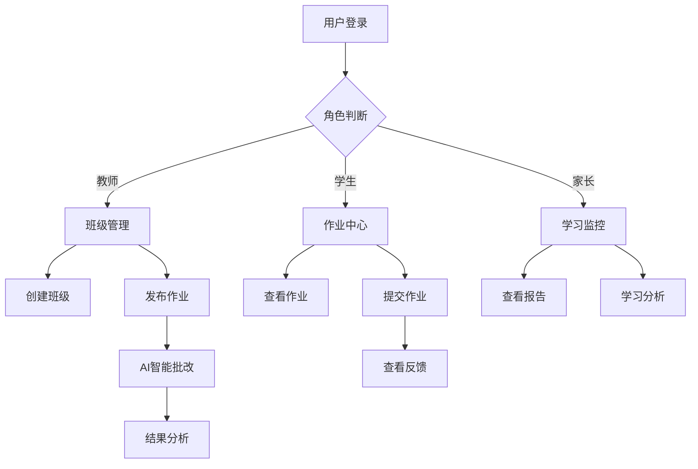

# AI教育平台产品需求文档

## 1. 产品概述

本项目是一个基于AI技术的智能教育平台，旨在为教师、学生和家长提供全面的在线教学、作业管理和智能批改服务。平台通过AI技术实现自动批改、学习分析和个性化教学建议，提升教育效率和学习效果。

目标市场：K12教育机构、培训机构、个人教师和学生群体，预期为教育数字化转型提供核心技术支撑。

## 2. 核心功能

### 2.1 用户角色

| 角色 | 注册方式 | 核心权限 |
|------|----------|----------|
| 学生 | 邮箱注册 | 查看作业、提交作业、查看成绩、AI学习助手 |
| 教师 | 邮箱注册 | 创建班级、发布作业、AI批改、学生管理、数据分析 |
| 家长 | 邮箱注册 | 查看孩子学习情况、成绩报告、学习分析 |

### 2.2 功能模块

我们的AI教育平台包含以下主要页面：
1. **班级仪表板**：班级概览、学生管理、成绩统计、学习分析图表
2. **作业系统**：作业创建、发布、提交、批改流程管理
3. **AI智能批改**：文件上传、AI分析、批改结果、反馈生成
4. **学习报告**：个人学习分析、班级统计、进度跟踪
5. **班级管理**：班级创建、学生邀请、权限管理
6. **用户管理**：个人资料、账户设置、角色切换
7. **AI助手**：智能问答、学习建议、错题分析

### 2.3 页面详情

| 页面名称 | 模块名称 | 功能描述 |
|----------|----------|----------|
| 班级仪表板 | 数据概览 | 显示班级基本信息、学生数量、平均成绩、完成率统计 |
| 班级仪表板 | 学生排行榜 | 展示学生成绩排名、进步情况、作业完成情况 |
| 班级仪表板 | 学习分析图表 | 班级成绩趋势、学科雷达图、个人vs班级平均对比 |
| 作业系统 | 作业创建 | 创建作业标题、描述、截止时间、评分标准、AI批改指令 |
| 作业系统 | 作业列表 | 显示所有作业、状态筛选、搜索功能、提交统计 |
| 作业系统 | 作业提交 | 学生上传作业文件、添加说明、查看提交历史 |
| 作业系统 | 批改管理 | 查看学生提交、AI批改结果、手动调整分数、添加评语 |
| AI智能批改 | 文件上传 | 支持题目文件、学生答案、批改标准三类文件上传 |
| AI智能批改 | 批改处理 | AI分析进度显示、批改状态跟踪、错误处理 |
| AI智能批改 | 结果分发 | 选择班级和学生、批量发送批改结果、通知管理 |
| 学习报告 | 个人报告 | 学生个人成绩分析、知识点掌握情况、学习建议 |
| 学习报告 | 班级报告 | 班级整体表现、学科分析、问题识别 |
| 班级管理 | 班级创建 | 创建新班级、设置班级信息、生成邀请码 |
| 班级管理 | 学生管理 | 添加/移除学生、查看学生信息、权限设置 |
| 用户管理 | 个人资料 | 编辑个人信息、头像上传、密码修改 |
| 用户管理 | 账户设置 | 通知设置、隐私设置、数据导出 |
| AI助手 | 智能问答 | 学习问题解答、知识点解释、学习方法建议 |
| AI助手 | 错题分析 | 错题收集、知识点关联、针对性练习推荐 |

## 3. 核心流程

### 教师流程
1. 教师注册登录 → 创建班级 → 邀请学生加入 → 创建作业 → 发布作业 → 查看学生提交 → AI批改/手动批改 → 发送反馈 → 查看学习分析报告

### 学生流程
1. 学生注册登录 → 加入班级 → 查看作业列表 → 下载作业文件 → 完成作业 → 上传提交 → 查看批改结果 → 查看学习报告 → 使用AI助手

### 家长流程
1. 家长注册登录 → 关联学生账户 → 查看孩子班级信息 → 查看作业完成情况 → 查看成绩报告 → 查看学习分析

## 4. 用户界面设计

### 4.1 设计风格
- **主色调**：蓝色系(#3B82F6)作为主色，绿色(#10B981)作为成功色，红色(#EF4444)作为警告色
- **按钮样式**：圆角按钮，支持悬停效果和加载状态
- **字体**：系统默认字体，标题使用16-24px，正文使用14-16px
- **布局风格**：卡片式布局，顶部导航栏，响应式设计
- **图标风格**：使用Lucide图标库，简洁现代风格

### 4.2 页面设计概览

| 页面名称 | 模块名称 | UI元素 |
|----------|----------|--------|
| 班级仪表板 | 数据卡片 | 统计卡片、进度条、徽章、头像组件 |
| 班级仪表板 | 图表区域 | 折线图、雷达图、柱状图，使用Recharts库 |
| 作业系统 | 作业卡片 | 标题、状态徽章、截止时间、进度指示器 |
| 作业系统 | 表单组件 | 输入框、文本域、日期选择器、文件上传 |
| AI批改系统 | 上传区域 | 拖拽上传、文件预览、进度条、状态指示 |
| AI批改系统 | 步骤指示器 | 三步流程：上传→批改→分发，带动画效果 |
| 学习报告 | 数据可视化 | 成绩趋势图、知识点雷达图、对比分析图 |
| 班级管理 | 表格组件 | 学生列表、操作按钮、搜索筛选 |

### 4.3 响应式设计
采用移动优先的响应式设计，支持桌面端、平板端和移动端。使用Tailwind CSS的响应式断点，确保在不同设备上的良好体验。触摸交互优化，支持手势操作。