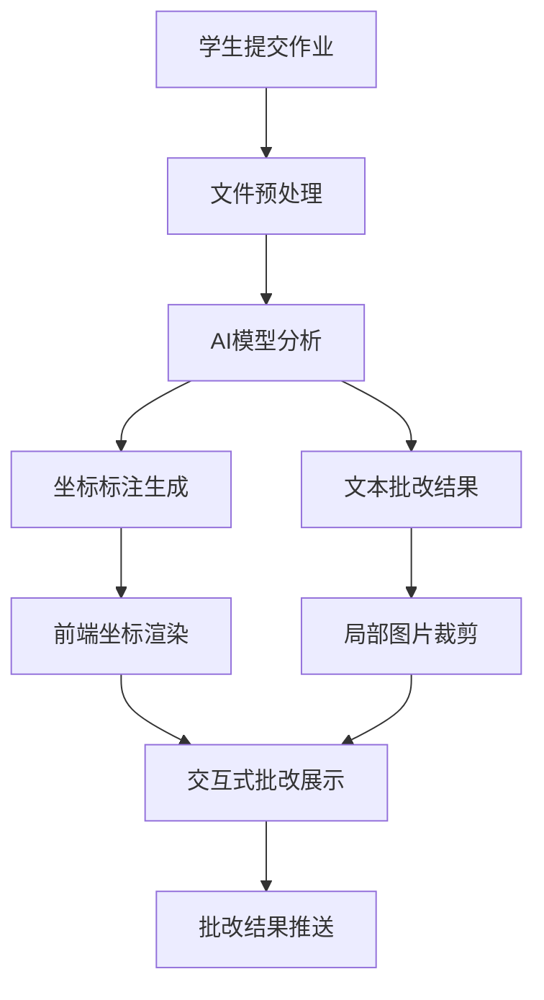

# AI教育平台完整需求文档 V2.0

## 1. 产品概述

### 1.1 产品定位
本产品是一个基于AI技术的智能教育平台，采用OpenRouter的Gemini 2.5 Flash Lite作为核心AI引擎，为教师、学生和家长提供智能作业批改、可视化反馈、数据分析和班级管理的一体化解决方案。

### 1.2 核心价值
- **智能批改**：基于AI的作业自动批改，支持图像识别和坐标标注
- **可视化反馈**：通过坐标标注和局部图片展示，提供直观的错误定位
- **数据互通**：完整的Excel数据导入导出，适应现有教学工作流
- **灵活管理**：支持平台内外作业统一管理，智能分配功能
- **个性化展示**：多样化的数据可视化模板，满足不同展示需求

### 1.3 目标用户
- **主要用户**：K12教师、学生
- **次要用户**：家长、教育管理者
- **使用场景**：日常作业批改、考试评分、学习分析、班级管理

## 2. 核心功能模块

### 2.1 智能批改系统

#### 2.1.1 AI批改引擎
- **AI模型**：OpenRouter Gemini 2.5 Flash Lite
- **输入支持**：图片、PDF、文本
- **批改类型**：主观题、客观题、计算题、作文等
- **批改标准**：完全遵循教师设定的答题标准和AI指示

#### 2.1.2 坐标标注批改展示
**功能描述**：在原图上精确标注错误位置，提供点击式详细反馈

**技术实现**：
- **AI侧**：输出错误的bounding box坐标(x,y,w,h)
- **前端侧**：
  - 使用Canvas或div overlay在图像上叠加标记点
  - 点击标记点触发浮窗显示批注内容
  - 支持缩放、拖拽操作
  - 移动端支持手势操作

**用户交互**：
```
1. 学生查看批改结果
2. 在原图上看到红色标注点
3. 点击标注点显示详细错误说明
4. 浮窗包含：错误类型、正确答案、知识点链接
5. 可切换查看原图和批改图
```

#### 2.1.3 局部图+文字穿插展示
**功能描述**：将错误区域裁剪为局部图，配合文字说明形成卡片式展示

**技术实现**：
- **AI侧**：输出错误区域坐标
- **后端侧**：使用OpenCV/PIL根据坐标裁剪原图生成局部图
- **前端侧**：
  - 渲染「局部图+AI文字」的卡片列表
  - 每个卡片附带「定位到原图」功能
  - 自动滚动并高亮对应区域

**卡片结构**：
```
┌─────────────────────────────┐
│ 错误 #1                     │
│ ┌─────────┐                │
│ │ 局部图   │ 错误说明：      │
│ │         │ 计算错误...     │
│ └─────────┘                │
│ 正确答案：xxx               │
│ 相关知识点：[链接]           │
│ [定位到原图] [查看解析]      │
└─────────────────────────────┘
```

#### 2.1.4 知识点关联
- **知识点库**：建立完整的知识点体系
- **自动关联**：AI自动识别错误对应的知识点
- **学习建议**：基于错误类型提供针对性学习建议
- **进度追踪**：记录学生知识点掌握情况

### 2.2 作业管理系统

#### 2.2.1 作业创建与发布
**基础功能**：
- 作业标题、描述、截止时间设置
- 多媒体附件支持（图片、PDF、视频）
- 评分标准设定
- 班级发布和个人发布

**AI批改配置**：
- **答题标准上传**：支持标准答案、评分细则
- **AI指示设定**：自定义AI批改的具体要求
- **批改模式选择**：严格模式、宽松模式、自定义模式
- **人工介入设置**：设定需要人工复核的分数阈值

#### 2.2.2 外部作业导入
**功能描述**：支持导入平台外的作业数据，统一管理

**导入方式**：
- **Excel导入**：支持标准Excel模板导入作业和成绩
- **图片批量导入**：支持扫描件、照片批量上传
- **第三方平台**：预留其他教学平台的数据接口

**智能分配功能**：
- **学生匹配**：基于姓名、学号自动匹配学生
- **作业归类**：AI自动识别作业类型和科目
- **批量处理**：支持批量导入和分配

#### 2.2.3 教师干预机制
**成绩调整**：
- 单题分数调整
- 总分修改
- 批改结果重评
- 添加教师评语

**批改审核**：
- AI批改结果预览
- 批量确认或修改
- 异常结果标记
- 学生申诉处理

### 2.3 数据管理与可视化

#### 2.3.1 Excel数据互通
**导出功能**：
- **成绩导出**：支持多种Excel格式导出
- **学生数据导出**：包含详细学习分析数据
- **班级统计导出**：班级整体表现数据
- **自定义导出**：用户可选择导出字段和格式

**导入功能**：
- **学生名单导入**：批量导入学生信息
- **历史成绩导入**：导入其他平台的成绩数据
- **模板支持**：提供标准Excel模板
- **数据验证**：自动验证导入数据的有效性

#### 2.3.2 可视化图表模板
**预设模板**：
1. **XY轴散点图**：成绩分布、进步趋势
2. **五角形雷达图**：多维能力评估
3. **六边形能力图**：学科综合能力
4. **排名条形图**：班级排名展示
5. **进度环形图**：学习进度显示
6. **热力图**：知识点掌握情况
7. **趋势折线图**：成绩变化趋势
8. **对比柱状图**：个人与班级对比

**自定义功能**：
- **数据源选择**：用户可选择不同的数据维度
- **样式自定义**：颜色、字体、图表类型调整
- **筛选功能**：按时间、科目、学生筛选数据
- **导出分享**：生成图片或PDF分享

### 2.4 班级管理系统

#### 2.4.1 班级创建与设置
- 班级基本信息（名称、年级、科目）
- 学生管理（添加、移除、分组）
- 权限设置（助教、家长查看权限）
- 班级公告发布

#### 2.4.2 学生数据管理
- **个人档案**：基本信息、学习特点、历史记录
- **学习轨迹**：作业提交记录、成绩变化趋势
- **能力画像**：基于AI分析的学习能力评估
- **家长沟通**：学习报告自动推送

#### 2.4.3 班级数据统计
- **实时概览**：作业完成情况、平均分、排名分布
- **趋势分析**：班级整体进步趋势
- **问题识别**：常见错误类型、薄弱知识点
- **对比分析**：与其他班级或历史数据对比

## 3. 用户界面设计

### 3.1 批改结果查看界面

#### 3.1.1 坐标标注模式
```
┌─────────────────────────────────────────┐
│ 作业：数学练习题 #1                      │
├─────────────────────────────────────────┤
│ [原图] [批改图] [详细报告]               │
├─────────────────────────────────────────┤
│                                         │
│     ┌─原图显示区域─────────┐             │
│     │                     │             │
│     │  📍 错误点1 (红色)   │             │
│     │                     │             │
│     │      📍 错误点2     │             │
│     │                     │             │
│     └─────────────────────┘             │
│                                         │
│ 🎯 点击红色标记查看详细批改             │
│                                         │
│ 批改概要：                              │
│ ✅ 正确：8题   ❌ 错误：2题              │
│ 📊 得分：80/100                         │
└─────────────────────────────────────────┘

点击错误点后弹出：
┌─────────────────────┐
│ 错误详情             │
│ ───────────────────  │
│ 题目：求x的值        │
│ 你的答案：x=5        │
│ 正确答案：x=3        │
│ 错误类型：计算错误    │
│ 知识点：一元一次方程  │
│ [查看解析] [相关练习] │
└─────────────────────┘
```

#### 3.1.2 局部图+文字模式
```
┌─────────────────────────────────────────┐
│ 作业批改报告                            │
├─────────────────────────────────────────┤
│ 错误分析 (2个错误)                      │
│                                         │
│ ┌─────────────────────────────────────┐ │
│ │ 错误 #1                             │ │
│ │ ┌─────────┐                        │ │
│ │ │         │ 错误说明：              │ │
│ │ │ 局部图   │ 在解方程时，移项符号    │ │
│ │ │         │ 处理错误。             │ │
│ │ └─────────┘                        │ │
│ │ 正确解法：2x+3=7 → 2x=7-3 → x=2   │ │
│ │ 知识点：一元一次方程移项法则        │ │
│ │ [定位原图] [查看详解] [相关练习]    │ │
│ └─────────────────────────────────────┘ │
│                                         │
│ ┌─────────────────────────────────────┐ │
│ │ 错误 #2                             │ │
│ │ ...类似结构...                      │ │
│ └─────────────────────────────────────┘ │
└─────────────────────────────────────────┘
```

### 3.2 教师工作台界面

#### 3.2.1 作业发布界面
```
┌─────────────────────────────────────────┐
│ 创建新作业                              │
├─────────────────────────────────────────┤
│ 基本信息                                │
│ 作业标题：[数学练习册P45-50]             │
│ 截止时间：[2024-01-20 23:59]            │
│ 目标班级：[✓高三1班] [✓高三2班]          │
│                                         │
│ 附件上传                                │
│ 📎 题目文件：[选择文件] 支持PDF/图片     │
│ 📎 答案标准：[选择文件] AI批改依据       │
│                                         │
│ AI批改设置                              │
│ 批改模式：[●严格] [○宽松] [○自定义]     │
│ 人工复核：[✓] 低于60分需人工确认        │
│                                         │
│ AI指示：                                │
│ ┌─────────────────────────────────────┐ │
│ │ 请严格按照标准答案批改，注意：        │ │
│ │ 1. 计算过程必须完整                 │ │
│ │ 2. 单位错误扣2分                   │ │
│ │ 3. 答案正确但过程错误给一半分        │ │
│ └─────────────────────────────────────┘ │
│                                         │
│ [保存草稿] [预览] [发布作业]             │
└─────────────────────────────────────────┘
```

#### 3.2.2 数据导入界面
```
┌─────────────────────────────────────────┐
│ 外部数据导入                            │
├─────────────────────────────────────────┤
│ 导入类型                                │
│ [●Excel成绩] [○学生名单] [○历史数据]    │
│                                         │
│ 文件上传                                │
│ ┌─────────────────────────────────────┐ │
│ │     📁 拖拽Excel文件到此处           │ │
│ │        或 [选择文件]                │ │
│ │                                     │ │
│ │     支持格式：.xlsx, .xls, .csv     │ │
│ └─────────────────────────────────────┘ │
│                                         │
│ 数据预览                                │
│ ┌─────────────────────────────────────┐ │
│ │ 姓名    | 学号   | 数学  | 语文     │ │
│ │ 张三    | 001    | 85    | 90      │ │
│ │ 李四    | 002    | 78    | 85      │ │
│ │ ...                                 │ │
│ └─────────────────────────────────────┘ │
│                                         │
│ 智能匹配                                │
│ 🤖 检测到15个学生，已自动匹配12个        │
│ ⚠️  3个学生需要手动确认                 │
│                                         │
│ [数据校验] [手动匹配] [确认导入]         │
└─────────────────────────────────────────┘
```

### 3.3 数据可视化界面

#### 3.3.1 图表模板选择
```
┌─────────────────────────────────────────┐
│ 数据可视化                              │
├─────────────────────────────────────────┤
│ 选择图表类型                            │
│                                         │
│ ┌─────┐ ┌─────┐ ┌─────┐ ┌─────┐        │
│ │ XY  │ │五角 │ │六边 │ │排名 │        │
│ │散点图│ │雷达图│ │能力图│ │条形图│        │
│ └─────┘ └─────┘ └─────┘ └─────┘        │
│                                         │
│ ┌─────┐ ┌─────┐ ┌─────┐ ┌─────┐        │
│ │进度 │ │热力 │ │趋势 │ │对比 │        │
│ │环形图│ │ 图  │ │折线图│ │柱状图│        │
│ └─────┘ └─────┘ └─────┘ └─────┘        │
│                                         │
│ 数据设置                                │
│ 数据源：[全班成绩] ▼                    │
│ X轴：[考试时间] ▼                       │
│ Y轴：[数学成绩] ▼                       │
│ 筛选：[最近3个月] ▼                     │
│                                         │
│ [预览图表] [生成报告] [导出PNG]          │
└─────────────────────────────────────────┘
```

## 4. 技术架构

### 4.1 前端技术栈
- **框架**：Next.js 14 + TypeScript
- **UI库**：Tailwind CSS + Shadcn/ui
- **图像处理**：Konva.js / Fabric.js
- **图表库**：Recharts + Chart.js
- **状态管理**：Zustand + React Query
- **文件处理**：React Dropzone

### 4.2 后端技术栈
- **框架**：FastAPI + Python 3.11
- **数据库**：PostgreSQL + Redis
- **AI服务**：OpenRouter Gemini 2.5 Flash Lite
- **图像处理**：OpenCV + Pillow
- **文档处理**：PyMuPDF + python-docx
- **数据处理**：Pandas + openpyxl

### 4.3 AI批改流程


### 4.4 数据流程


## 5. 关键接口设计

### 5.1 AI批改接口
```python
# POST /api/v1/grading/submit
{
    "assignment_id": "uuid",
    "student_id": "uuid",
    "submission_files": ["file_urls"],
    "grading_standard": "file_url",
    "ai_instructions": "详细批改要求",
    "mode": "strict|loose|custom"
}

# Response
{
    "task_id": "uuid",
    "status": "pending",
    "estimated_time": 300
}

# GET /api/v1/grading/result/{task_id}
{
    "task_id": "uuid",
    "status": "completed",
    "score": 85,
    "total_score": 100,
    "errors": [
        {
            "error_id": "uuid",
            "coordinates": {"x": 100, "y": 200, "w": 50, "h": 30},
            "error_type": "calculation_error",
            "description": "移项符号错误",
            "correct_answer": "x=3",
            "knowledge_points": ["一元一次方程"],
            "cropped_image_url": "image_url"
        }
    ],
    "feedback": "整体表现良好，需要注意符号处理"
}
```

### 5.2 数据管理接口
```python
# POST /api/v1/data/import/excel
{
    "file_url": "uploaded_excel_url",
    "import_type": "grades|students|assignments",
    "class_id": "uuid",
    "mapping_config": {
        "name_column": "A",
        "id_column": "B",
        "score_columns": ["C", "D", "E"]
    }
}

# GET /api/v1/data/export/excel
{
    "data_type": "class_report|student_analysis|grade_summary",
    "class_id": "uuid",
    "date_range": {"start": "2024-01-01", "end": "2024-12-31"},
    "template": "standard|detailed|custom"
}
```

## 6. 开发路线图

### 6.1 第一阶段（MVP）- 4周
- [x] 基础认证系统
- [x] 班级管理功能
- [ ] **基础作业发布**
- [ ] **AI批改核心功能**
- [ ] **坐标标注展示**
- [ ] **局部图生成**

### 6.2 第二阶段（增强版）- 3周
- [ ] Excel数据导入导出
- [ ] 教师干预机制
- [ ] 外部作业导入
- [ ] 基础数据可视化

### 6.3 第三阶段（完整版）- 3周
- [ ] 智能数据分配
- [ ] 高级可视化模板
- [ ] 移动端优化
- [ ] 性能优化

## 7. 验收标准

### 7.1 核心功能验收
1. **AI批改准确性**: 准确率≥85%
2. **坐标标注精度**: 误差≤5像素
3. **响应时间**: 批改结果≤30秒
4. **数据导入成功率**: ≥95%

### 7.2 用户体验验收
1. **界面响应**: 页面加载≤3秒
2. **移动端适配**: 支持主流移动设备
3. **错误处理**: 友好的错误提示
4. **操作流畅度**: 无明显卡顿

### 7.3 数据安全验收
1. **数据加密**: 敏感数据全程加密
2. **权限控制**: 严格的角色权限管理
3. **数据备份**: 自动备份机制
4. **隐私保护**: 符合教育数据隐私规范

## 8. 风险控制

### 8.1 技术风险
- **AI模型稳定性**: 备用模型方案
- **图像识别精度**: 人工校验机制
- **并发处理能力**: 负载均衡设计

### 8.2 业务风险
- **用户接受度**: 分阶段推广
- **数据迁移**: 完整的回滚方案
- **教学适应性**: 可配置的批改标准

这个完整的需求文档涵盖了您提出的所有核心需求，特别强调了：
1. **智能批改的可视化展示**（坐标标注+局部图）
2. **Excel数据的完整互通**（导入导出+智能匹配）
3. **教师的完全控制权**（干预机制+自定义标准）
4. **用户友好的设计**（适应现有工作流+灵活配置）
5. **多样化的数据展示**（8种图表模板+自定义选项）

接下来我建议按照开发路线图逐步实现，优先完成MVP版本以快速验证核心功能的可行性。