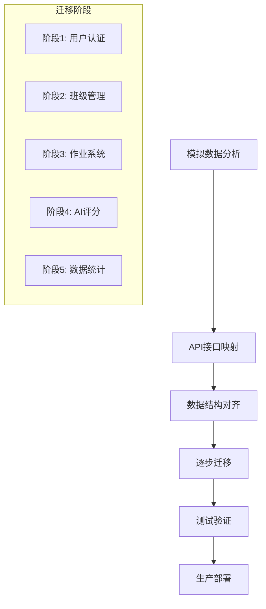

# AI教育平台模拟数据迁移指南

## 1. 迁移概述

本指南将帮助您将前端组件从使用模拟数据过渡到连接真实的后端API，确保数据的一致性和功能的完整性。

### 1.1 迁移策略



## 2. 前端组件分析

### 2.1 class-dashboard.tsx 数据迁移

#### 当前模拟数据结构
```typescript
// 现有模拟数据
interface Student {
  id: string;
  name: string;
  email: string;
  grade: string;
  performance: number;
  assignments: number;
  lastActive: string;
}

interface ClassData {
  id: string;
  name: string;
  students: Student[];
  totalAssignments: number;
  averageScore: number;
  completionRate: number;
}

// 模拟数据
const mockClassData: ClassData = {
  id: "class-001",
  name: "高三数学1班",
  students: [
    {
      id: "student-001",
      name: "张三",
      email: "zhangsan@example.com",
      grade: "高三",
      performance: 85,
      assignments: 12,
      lastActive: "2024-01-15"
    }
    // ... 更多学生数据
  ],
  totalAssignments: 15,
  averageScore: 82.5,
  completionRate: 78
};
```

#### 迁移到真实API
```typescript
// API服务配置
const API_BASE_URL = process.env.NEXT_PUBLIC_API_URL || 'http://localhost:8000';

// API接口定义
class ClassAPI {
  // 获取班级详情
  static async getClassDetails(classId: string): Promise<ClassData> {
    const response = await fetch(`${API_BASE_URL}/api/classes/${classId}`, {
      headers: {
        'Authorization': `Bearer ${getAuthToken()}`,
        'Content-Type': 'application/json'
      }
    });
    
    if (!response.ok) {
      throw new Error('Failed to fetch class details');
    }
    
    return response.json();
  }
  
  // 获取班级学生列表
  static async getClassStudents(classId: string): Promise<Student[]> {
    const response = await fetch(`${API_BASE_URL}/api/classes/${classId}/students`, {
      headers: {
        'Authorization': `Bearer ${getAuthToken()}`,
        'Content-Type': 'application/json'
      }
    });
    
    if (!response.ok) {
      throw new Error('Failed to fetch students');
    }
    
    return response.json();
  }
  
  // 获取班级统计数据
  static async getClassStats(classId: string): Promise<ClassStats> {
    const response = await fetch(`${API_BASE_URL}/api/classes/${classId}/stats`, {
      headers: {
        'Authorization': `Bearer ${getAuthToken()}`,
        'Content-Type': 'application/json'
      }
    });
    
    
    if (!response.ok) {
      throw new Error('Failed to fetch class stats');
    }
    
    return response.json();
  }
}

// 组件迁移
export default function ClassDashboard() {
  const [classData, setClassData] = useState<ClassData | null>(null);
  const [students, setStudents] = useState<Student[]>([]);
  const [loading, setLoading] = useState(true);
  const [error, setError] = useState<string | null>(null);
  
  useEffect(() => {
    const loadClassData = async () => {
      try {
        setLoading(true);
        const classId = getCurrentClassId(); // 从路由或上下文获取
        
        // 并行加载数据
        const [classDetails, classStudents, classStats] = await Promise.all([
          ClassAPI.getClassDetails(classId),
          ClassAPI.getClassStudents(classId),
          ClassAPI.getClassStats(classId)
        ]);
        
        setClassData({
          ...classDetails,
          students: classStudents,
          ...classStats
        });
        setStudents(classStudents);
      } catch (err) {
        setError(err instanceof Error ? err.message : '加载数据失败');
      } finally {
        setLoading(false);
      }
    };
    
    loadClassData();
  }, []);
  
  if (loading) return <LoadingSpinner />;
  if (error) return <ErrorMessage message={error} />;
  if (!classData) return <NoDataMessage />;
  
  return (
    <div className="class-dashboard">
      {/* 渲染组件 */}
    </div>
  );
}
```

### 2.2 ai-grading-system.tsx 数据迁移

#### 当前模拟数据结构
```typescript
// 现有模拟数据
interface UploadedFile {
  id: string;
  name: string;
  size: number;
  type: string;
  uploadTime: string;
}

interface GradingTask {
  id: string;
  assignmentId: string;
  files: UploadedFile[];
  status: 'pending' | 'processing' | 'completed' | 'failed';
  progress: number;
  results?: GradingResult[];
}

// 模拟数据
const mockGradingTasks: GradingTask[] = [
  {
    id: "task-001",
    assignmentId: "assignment-001",
    files: [
      {
        id: "file-001",
        name: "数学作业_张三.pdf",
        size: 2048576,
        type: "application/pdf",
        uploadTime: "2024-01-15T10:30:00Z"
      }
    ],
    status: "completed",
    progress: 100,
    results: [
      {
        studentId: "student-001",
        score: 85,
        feedback: "解题思路清晰，计算准确",
        detailedAnalysis: "..."
      }
    ]
  }
];
```

#### 迁移到真实API
```typescript
// AI评分API服务
class GradingAPI {
  // 创建评分任务
  static async createGradingTask(assignmentId: string, files: File[]): Promise<GradingTask> {
    const formData = new FormData();
    formData.append('assignment_id', assignmentId);
    
    files.forEach((file, index) => {
      formData.append(`files`, file);
    });
    
    const response = await fetch(`${API_BASE_URL}/api/grading/tasks`, {
      method: 'POST',
      headers: {
        'Authorization': `Bearer ${getAuthToken()}`
      },
      body: formData
    });
    
    if (!response.ok) {
      throw new Error('Failed to create grading task');
    }
    
    return response.json();
  }
  
  // 获取评分任务状态
  static async getGradingTaskStatus(taskId: string): Promise<GradingTask> {
    const response = await fetch(`${API_BASE_URL}/api/grading/tasks/${taskId}`, {
      headers: {
        'Authorization': `Bearer ${getAuthToken()}`,
        'Content-Type': 'application/json'
      }
    });
    
    if (!response.ok) {
      throw new Error('Failed to fetch grading task status');
    }
    
    return response.json();
  }
  
  // 获取评分结果
  static async getGradingResults(taskId: string): Promise<GradingResult[]> {
    const response = await fetch(`${API_BASE_URL}/api/grading/tasks/${taskId}/results`, {
      headers: {
        'Authorization': `Bearer ${getAuthToken()}`,
        'Content-Type': 'application/json'
      }
    });
    
    if (!response.ok) {
      throw new Error('Failed to fetch grading results');
    }
    
    return response.json();
  }
}

// 组件迁移
export default function AIGradingSystem() {
  const [gradingTasks, setGradingTasks] = useState<GradingTask[]>([]);
  const [uploading, setUploading] = useState(false);
  const [error, setError] = useState<string | null>(null);
  
  // 文件上传处理
  const handleFileUpload = async (files: File[], assignmentId: string) => {
    try {
      setUploading(true);
      setError(null);
      
      // 创建评分任务
      const task = await GradingAPI.createGradingTask(assignmentId, files);
      
      // 添加到任务列表
      setGradingTasks(prev => [task, ...prev]);
      
      // 开始轮询任务状态
      pollTaskStatus(task.id);
      
    } catch (err) {
      setError(err instanceof Error ? err.message : '上传失败');
    } finally {
      setUploading(false);
    }
  };
  
  // 轮询任务状态
  const pollTaskStatus = async (taskId: string) => {
    const pollInterval = setInterval(async () => {
      try {
        const updatedTask = await GradingAPI.getGradingTaskStatus(taskId);
        
        setGradingTasks(prev => 
          prev.map(task => 
            task.id === taskId ? updatedTask : task
          )
        );
        
        // 如果任务完成，停止轮询
        if (updatedTask.status === 'completed' || updatedTask.status === 'failed') {
          clearInterval(pollInterval);
        }
      } catch (err) {
        console.error('Failed to poll task status:', err);
        clearInterval(pollInterval);
      }
    }, 2000); // 每2秒轮询一次
    
    // 清理定时器
    return () => clearInterval(pollInterval);
  };
  
  return (
    <div className="ai-grading-system">
      {/* 渲染组件 */}
    </div>
  );
}
```

### 2.3 assignment-system.tsx 数据迁移

#### 当前模拟数据结构
```typescript
// 现有模拟数据
interface Assignment {
  id: string;
  title: string;
  description: string;
  dueDate: string;
  status: 'draft' | 'published' | 'closed';
  submissions: number;
  totalStudents: number;
}

interface Submission {
  id: string;
  studentId: string;
  studentName: string;
  assignmentId: string;
  submittedAt: string;
  status: 'submitted' | 'graded' | 'returned';
  score?: number;
  feedback?: string;
}

// 模拟数据
const mockAssignments: Assignment[] = [
  {
    id: "assignment-001",
    title: "数学期中考试",
    description: "涵盖第1-5章内容的综合测试",
    dueDate: "2024-01-20T23:59:59Z",
    status: "published",
    submissions: 25,
    totalStudents: 30
  }
];
```

#### 迁移到真实API
```typescript
// 作业API服务
class AssignmentAPI {
  // 获取作业列表
  static async getAssignments(classId: string, filters?: AssignmentFilters): Promise<Assignment[]> {
    const queryParams = new URLSearchParams();
    if (filters?.status) queryParams.append('status', filters.status);
    if (filters?.subject) queryParams.append('subject', filters.subject);
    
    const response = await fetch(
      `${API_BASE_URL}/api/classes/${classId}/assignments?${queryParams}`,
      {
        headers: {
          'Authorization': `Bearer ${getAuthToken()}`,
          'Content-Type': 'application/json'
        }
      }
    );
    
    if (!response.ok) {
      throw new Error('Failed to fetch assignments');
    }
    
    return response.json();
  }
  
  // 创建作业
  static async createAssignment(classId: string, assignment: CreateAssignmentRequest): Promise<Assignment> {
    const response = await fetch(`${API_BASE_URL}/api/classes/${classId}/assignments`, {
      method: 'POST',
      headers: {
        'Authorization': `Bearer ${getAuthToken()}`,
        'Content-Type': 'application/json'
      },
      body: JSON.stringify(assignment)
    });
    
    if (!response.ok) {
      throw new Error('Failed to create assignment');
    }
    
    return response.json();
  }
  
  // 获取作业提交
  static async getSubmissions(assignmentId: string): Promise<Submission[]> {
    const response = await fetch(`${API_BASE_URL}/api/assignments/${assignmentId}/submissions`, {
      headers: {
        'Authorization': `Bearer ${getAuthToken()}`,
        'Content-Type': 'application/json'
      }
    });
    
    if (!response.ok) {
      throw new Error('Failed to fetch submissions');
    }
    
    return response.json();
  }
  
  // 更新作业状态
  static async updateAssignmentStatus(assignmentId: string, status: AssignmentStatus): Promise<Assignment> {
    const response = await fetch(`${API_BASE_URL}/api/assignments/${assignmentId}/status`, {
      method: 'PATCH',
      headers: {
        'Authorization': `Bearer ${getAuthToken()}`,
        'Content-Type': 'application/json'
      },
      body: JSON.stringify({ status })
    });
    
    if (!response.ok) {
      throw new Error('Failed to update assignment status');
    }
    
    return response.json();
  }
}

// 组件迁移
export default function AssignmentSystem() {
  const [assignments, setAssignments] = useState<Assignment[]>([]);
  const [submissions, setSubmissions] = useState<Submission[]>([]);
  const [loading, setLoading] = useState(true);
  const [error, setError] = useState<string | null>(null);
  
  // 加载作业列表
  useEffect(() => {
    const loadAssignments = async () => {
      try {
        setLoading(true);
        const classId = getCurrentClassId();
        const assignmentList = await AssignmentAPI.getAssignments(classId);
        setAssignments(assignmentList);
      } catch (err) {
        setError(err instanceof Error ? err.message : '加载作业失败');
      } finally {
        setLoading(false);
      }
    };
    
    loadAssignments();
  }, []);
  
  // 创建新作业
  const handleCreateAssignment = async (assignmentData: CreateAssignmentRequest) => {
    try {
      const classId = getCurrentClassId();
      const newAssignment = await AssignmentAPI.createAssignment(classId, assignmentData);
      setAssignments(prev => [newAssignment, ...prev]);
    } catch (err) {
      setError(err instanceof Error ? err.message : '创建作业失败');
    }
  };
  
  // 加载作业提交
  const handleLoadSubmissions = async (assignmentId: string) => {
    try {
      const submissionList = await AssignmentAPI.getSubmissions(assignmentId);
      setSubmissions(submissionList);
    } catch (err) {
      setError(err instanceof Error ? err.message : '加载提交失败');
    }
  };
  
  return (
    <div className="assignment-system">
      {/* 渲染组件 */}
    </div>
  );
}
```

## 3. 认证系统集成

### 3.1 认证上下文
```typescript
// contexts/AuthContext.tsx
interface AuthContextType {
  user: User | null;
  token: string | null;
  login: (email: string, password: string) => Promise<void>;
  logout: () => void;
  isAuthenticated: boolean;
  loading: boolean;
}

const AuthContext = createContext<AuthContextType | undefined>(undefined);

export function AuthProvider({ children }: { children: React.ReactNode }) {
  const [user, setUser] = useState<User | null>(null);
  const [token, setToken] = useState<string | null>(null);
  const [loading, setLoading] = useState(true);
  
  useEffect(() => {
    // 从localStorage恢复认证状态
    const savedToken = localStorage.getItem('auth_token');
    const savedUser = localStorage.getItem('user_data');
    
    if (savedToken && savedUser) {
      setToken(savedToken);
      setUser(JSON.parse(savedUser));
    }
    
    setLoading(false);
  }, []);
  
  const login = async (email: string, password: string) => {
    const response = await fetch(`${API_BASE_URL}/api/auth/login`, {
      method: 'POST',
      headers: {
        'Content-Type': 'application/json'
      },
      body: JSON.stringify({ email, password })
    });
    
    if (!response.ok) {
      throw new Error('登录失败');
    }
    
    const data = await response.json();
    
    setToken(data.access_token);
    setUser(data.user);
    
    localStorage.setItem('auth_token', data.access_token);
    localStorage.setItem('user_data', JSON.stringify(data.user));
  };
  
  const logout = () => {
    setToken(null);
    setUser(null);
    localStorage.removeItem('auth_token');
    localStorage.removeItem('user_data');
  };
  
  return (
    <AuthContext.Provider value={{
      user,
      token,
      login,
      logout,
      isAuthenticated: !!token,
      loading
    }}>
      {children}
    </AuthContext.Provider>
  );
}

export const useAuth = () => {
  const context = useContext(AuthContext);
  if (context === undefined) {
    throw new Error('useAuth must be used within an AuthProvider');
  }
  return context;
};
```

### 3.2 API请求拦截器
```typescript
// utils/api.ts
class APIClient {
  private baseURL: string;
  private token: string | null = null;
  
  constructor(baseURL: string) {
    this.baseURL = baseURL;
  }
  
  setToken(token: string | null) {
    this.token = token;
  }
  
  private async request<T>(endpoint: string, options: RequestInit = {}): Promise<T> {
    const url = `${this.baseURL}${endpoint}`;
    
    const config: RequestInit = {
      ...options,
      headers: {
        'Content-Type': 'application/json',
        ...(this.token && { 'Authorization': `Bearer ${this.token}` }),
        ...options.headers
      }
    };
    
    const response = await fetch(url, config);
    
    if (!response.ok) {
      if (response.status === 401) {
        // Token过期，重定向到登录页
        window.location.href = '/login';
        throw new Error('认证失败');
      }
      
      const errorData = await response.json().catch(() => ({}));
      throw new Error(errorData.message || `HTTP ${response.status}`);
    }
    
    return response.json();
  }
  
  get<T>(endpoint: string): Promise<T> {
    return this.request<T>(endpoint, { method: 'GET' });
  }
  
  post<T>(endpoint: string, data?: any): Promise<T> {
    return this.request<T>(endpoint, {
      method: 'POST',
      body: data ? JSON.stringify(data) : undefined
    });
  }
  
  put<T>(endpoint: string, data?: any): Promise<T> {
    return this.request<T>(endpoint, {
      method: 'PUT',
      body: data ? JSON.stringify(data) : undefined
    });
  }
  
  delete<T>(endpoint: string): Promise<T> {
    return this.request<T>(endpoint, { method: 'DELETE' });
  }
}

export const apiClient = new APIClient(process.env.NEXT_PUBLIC_API_URL || 'http://localhost:8000');
```

## 4. 错误处理和加载状态

### 4.1 全局错误处理
```typescript
// hooks/useErrorHandler.ts
export function useErrorHandler() {
  const [error, setError] = useState<string | null>(null);
  
  const handleError = useCallback((err: unknown) => {
    if (err instanceof Error) {
      setError(err.message);
    } else {
      setError('发生未知错误');
    }
    
    // 记录错误到监控服务
    console.error('Application error:', err);
  }, []);
  
  const clearError = useCallback(() => {
    setError(null);
  }, []);
  
  return { error, handleError, clearError };
}
```

### 4.2 加载状态管理
```typescript
// hooks/useAsyncOperation.ts
export function useAsyncOperation<T>() {
  const [data, setData] = useState<T | null>(null);
  const [loading, setLoading] = useState(false);
  const [error, setError] = useState<string | null>(null);
  
  const execute = useCallback(async (operation: () => Promise<T>) => {
    try {
      setLoading(true);
      setError(null);
      const result = await operation();
      setData(result);
      return result;
    } catch (err) {
      const errorMessage = err instanceof Error ? err.message : '操作失败';
      setError(errorMessage);
      throw err;
    } finally {
      setLoading(false);
    }
  }, []);
  
  return { data, loading, error, execute, setData };
}
```

## 5. 数据缓存策略

### 5.1 React Query集成
```typescript
// 安装依赖
// npm install @tanstack/react-query

// hooks/useClassData.ts
import { useQuery, useMutation, useQueryClient } from '@tanstack/react-query';

export function useClassData(classId: string) {
  return useQuery({
    queryKey: ['class', classId],
    queryFn: () => ClassAPI.getClassDetails(classId),
    staleTime: 5 * 60 * 1000, // 5分钟
    cacheTime: 10 * 60 * 1000, // 10分钟
  });
}

export function useClassStudents(classId: string) {
  return useQuery({
    queryKey: ['class', classId, 'students'],
    queryFn: () => ClassAPI.getClassStudents(classId),
    staleTime: 2 * 60 * 1000, // 2分钟
  });
}

export function useCreateAssignment() {
  const queryClient = useQueryClient();
  
  return useMutation({
    mutationFn: ({ classId, assignment }: { classId: string; assignment: CreateAssignmentRequest }) =>
      AssignmentAPI.createAssignment(classId, assignment),
    onSuccess: (data, variables) => {
      // 更新相关缓存
      queryClient.invalidateQueries(['class', variables.classId, 'assignments']);
      queryClient.setQueryData(['assignment', data.id], data);
    },
  });
}
```

### 5.2 本地存储缓存
```typescript
// utils/cache.ts
class LocalCache {
  private static instance: LocalCache;
  private cache = new Map<string, { data: any; timestamp: number; ttl: number }>();
  
  static getInstance(): LocalCache {
    if (!LocalCache.instance) {
      LocalCache.instance = new LocalCache();
    }
    return LocalCache.instance;
  }
  
  set(key: string, data: any, ttl: number = 5 * 60 * 1000): void {
    this.cache.set(key, {
      data,
      timestamp: Date.now(),
      ttl
    });
  }
  
  get(key: string): any | null {
    const item = this.cache.get(key);
    
    if (!item) {
      return null;
    }
    
    if (Date.now() - item.timestamp > item.ttl) {
      this.cache.delete(key);
      return null;
    }
    
    return item.data;
  }
  
  clear(): void {
    this.cache.clear();
  }
}

export const localCache = LocalCache.getInstance();
```

## 6. 实时数据更新

### 6.1 WebSocket连接
```typescript
// hooks/useWebSocket.ts
export function useWebSocket(url: string) {
  const [socket, setSocket] = useState<WebSocket | null>(null);
  const [connected, setConnected] = useState(false);
  const [error, setError] = useState<string | null>(null);
  
  useEffect(() => {
    const ws = new WebSocket(url);
    
    ws.onopen = () => {
      setConnected(true);
      setError(null);
    };
    
    ws.onclose = () => {
      setConnected(false);
    };
    
    ws.onerror = (event) => {
      setError('WebSocket连接错误');
    };
    
    setSocket(ws);
    
    return () => {
      ws.close();
    };
  }, [url]);
  
  const sendMessage = useCallback((message: any) => {
    if (socket && connected) {
      socket.send(JSON.stringify(message));
    }
  }, [socket, connected]);
  
  return { socket, connected, error, sendMessage };
}
```

### 6.2 实时评分进度
```typescript
// hooks/useGradingProgress.ts
export function useGradingProgress(taskId: string) {
  const [progress, setProgress] = useState(0);
  const [status, setStatus] = useState<GradingStatus>('pending');
  
  const wsUrl = `${process.env.NEXT_PUBLIC_WS_URL}/ws/grading/${taskId}`;
  const { socket, connected } = useWebSocket(wsUrl);
  
  useEffect(() => {
    if (socket) {
      socket.onmessage = (event) => {
        const data = JSON.parse(event.data);
        
        if (data.type === 'progress_update') {
          setProgress(data.progress);
          setStatus(data.status);
        }
      };
    }
  }, [socket]);
  
  return { progress, status, connected };
}
```

## 7. 测试策略

### 7.1 API模拟测试
```typescript
// __tests__/api/ClassAPI.test.ts
import { rest } from 'msw';
import { setupServer } from 'msw/node';
import { ClassAPI } from '../api/ClassAPI';

const server = setupServer(
  rest.get('/api/classes/:classId', (req, res, ctx) => {
    return res(
      ctx.json({
        id: req.params.classId,
        name: '测试班级',
        students: [],
        totalAssignments: 0,
        averageScore: 0,
        completionRate: 0
      })
    );
  })
);

beforeAll(() => server.listen());
afterEach(() => server.resetHandlers());
afterAll(() => server.close());

test('获取班级详情', async () => {
  const classData = await ClassAPI.getClassDetails('test-class-id');
  expect(classData.name).toBe('测试班级');
});
```

### 7.2 组件集成测试
```typescript
// __tests__/components/ClassDashboard.test.tsx
import { render, screen, waitFor } from '@testing-library/react';
import { QueryClient, QueryClientProvider } from '@tanstack/react-query';
import ClassDashboard from '../components/ClassDashboard';

const createTestQueryClient = () => new QueryClient({
  defaultOptions: {
    queries: { retry: false },
    mutations: { retry: false },
  },
});

test('显示班级数据', async () => {
  const queryClient = createTestQueryClient();
  
  render(
    <QueryClientProvider client={queryClient}>
      <ClassDashboard />
    </QueryClientProvider>
  );
  
  await waitFor(() => {
    expect(screen.getByText('测试班级')).toBeInTheDocument();
  });
});
```

## 8. 迁移检查清单

### 8.1 数据迁移检查
- [ ] 所有模拟数据已识别
- [ ] API接口已定义
- [ ] 数据结构已对齐
- [ ] 错误处理已实现
- [ ] 加载状态已添加
- [ ] 认证集成已完成
- [ ] 缓存策略已实施
- [ ] 实时更新已配置

### 8.2 功能测试检查
- [ ] 用户登录/登出
- [ ] 班级数据加载
- [ ] 学生列表显示
- [ ] 作业创建/编辑
- [ ] 文件上传功能
- [ ] AI评分进度
- [ ] 数据统计图表
- [ ] 错误处理显示

### 8.3 性能优化检查
- [ ] API请求优化
- [ ] 数据缓存实施
- [ ] 组件懒加载
- [ ] 图片优化
- [ ] 代码分割
- [ ] 包大小优化

## 9. 部署后验证

### 9.1 功能验证脚本
```typescript
// scripts/verify-deployment.ts
const API_BASE_URL = process.env.NEXT_PUBLIC_API_URL;

async function verifyDeployment() {
  const tests = [
    {
      name: '健康检查',
      test: () => fetch(`${API_BASE_URL}/health`)
    },
    {
      name: '用户认证',
      test: () => fetch(`${API_BASE_URL}/api/auth/login`, {
        method: 'POST',
        headers: { 'Content-Type': 'application/json' },
        body: JSON.stringify({
          email: 'test@example.com',
          password: 'testpassword'
        })
      })
    },
    {
      name: '班级API',
      test: () => fetch(`${API_BASE_URL}/api/classes`, {
        headers: { 'Authorization': 'Bearer test-token' }
      })
    }
  ];
  
  for (const test of tests) {
    try {
      const response = await test.test();
      console.log(`✅ ${test.name}: ${response.status}`);
    } catch (error) {
      console.log(`❌ ${test.name}: ${error}`);
    }
  }
}

verifyDeployment();
```

### 9.2 监控设置
```typescript
// utils/monitoring.ts
class PerformanceMonitor {
  static trackAPICall(endpoint: string, duration: number, success: boolean) {
    // 发送到监控服务
    console.log(`API Call: ${endpoint}, Duration: ${duration}ms, Success: ${success}`);
  }
  
  static trackUserAction(action: string, metadata?: any) {
    // 用户行为追踪
    console.log(`User Action: ${action}`, metadata);
  }
  
  static trackError(error: Error, context?: any) {
    // 错误追踪
    console.error('Application Error:', error, context);
  }
}

export { PerformanceMonitor };
```

完成以上迁移步骤后，您的AI教育平台将成功从模拟数据过渡到真实的后端API，提供完整的数据驱动功能。