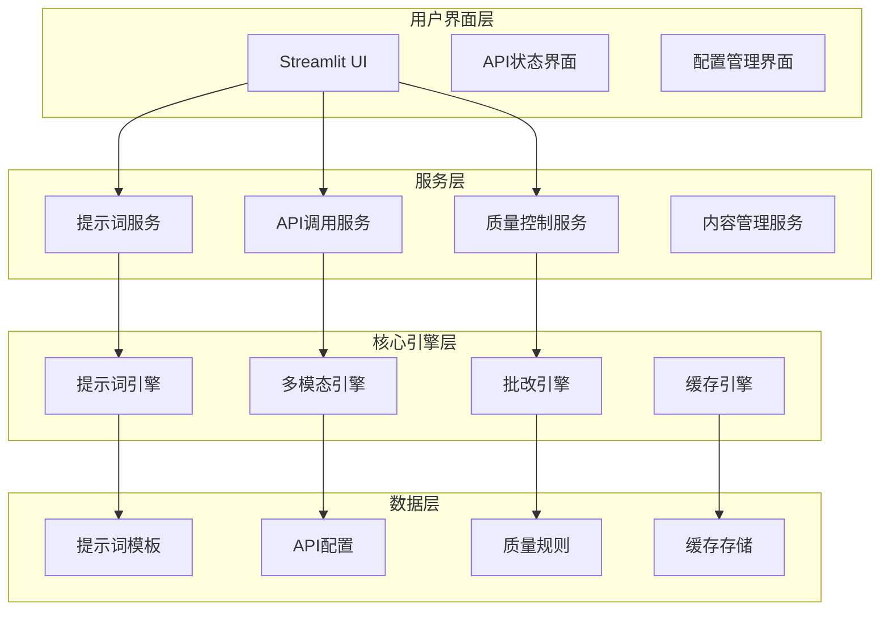

# AI功能提示词优化与调用功能完善 - 设计文档

## 概述

本设计文档基于需求分析，提出了一个全面的AI功能提示词优化和调用功能完善的解决方案。系统将采用模块化架构，通过智能提示词管理、多模态内容处理、稳定的API调用机制和质量控制系统，为用户提供高质量、一致性的AI批改服务。

## 架构设计

### 整体架构



### 核心组件设计

#### 1. 智能提示词管理系统

**提示词引擎 (PromptEngine)**
- 负责提示词的生成、优化和管理
- 支持动态提示词组装和上下文适配
- 提供提示词版本控制和A/B测试功能

**提示词模板库 (PromptTemplateLibrary)**
- 存储各种场景的提示词模板
- 支持模板继承和组合
- 提供模板性能分析和优化建议

#### 2. 多模态内容处理系统

**内容识别器 (ContentRecognizer)**
- 自动识别文件类型和内容结构
- 支持文本、图像、PDF等多种格式
- 提供内容预处理和格式标准化

**多模态处理器 (MultiModalProcessor)**
- 统一处理不同类型的输入内容
- 支持内容压缩和优化
- 提供错误恢复和降级处理

#### 3. API调用管理系统

**API调用管理器 (APICallManager)**
- 管理多个API提供商和模型
- 实现智能路由和负载均衡
- 提供调用统计和性能监控

**重试和恢复机制 (RetryRecoverySystem)**
- 实现指数退避重试策略
- 支持多模型自动切换
- 提供详细的错误诊断和恢复建议

## 组件详细设计

### 1. 提示词系统重构

#### 1.1 提示词分层架构

```python
class PromptLayer:
    """提示词分层架构"""
    
    # 系统层：定义AI角色和基本行为
    SYSTEM_LAYER = "system"
    
    # 任务层：定义具体任务和目标
    TASK_LAYER = "task"
    
    # 上下文层：提供具体的上下文信息
    CONTEXT_LAYER = "context"
    
    # 格式层：定义输出格式和约束
    FORMAT_LAYER = "format"
    
    # 质量层：定义质量控制和验证规则
    QUALITY_LAYER = "quality"
```

#### 1.2 动态提示词生成器

```python
class DynamicPromptGenerator:
    """动态提示词生成器"""
    
    def __init__(self):
        self.template_manager = PromptTemplateManager()
        self.context_analyzer = ContextAnalyzer()
        self.quality_controller = QualityController()
    
    def generate_prompt(self, task_type: str, content_info: Dict, 
                       quality_requirements: Dict) -> str:
        """生成优化的提示词"""
        
        # 分析内容特征
        content_features = self.context_analyzer.analyze(content_info)
        
        # 选择最佳模板
        base_template = self.template_manager.select_template(
            task_type, content_features
        )
        
        # 动态组装提示词
        prompt_components = {
            'system': self._build_system_prompt(task_type),
            'task': self._build_task_prompt(task_type, content_features),
            'context': self._build_context_prompt(content_info),
            'format': self._build_format_prompt(quality_requirements),
            'quality': self._build_quality_prompt(quality_requirements)
        }
        
        # 组装最终提示词
        return self._assemble_prompt(prompt_components)
```

#### 1.3 提示词模板管理

```python
class PromptTemplateManager:
    """提示词模板管理器"""
    
    def __init__(self):
        self.templates = self._load_templates()
        self.performance_tracker = PerformanceTracker()
    
    def select_template(self, task_type: str, features: Dict) -> PromptTemplate:
        """智能选择最佳模板"""
        
        candidates = self._get_candidate_templates(task_type)
        
        # 基于特征匹配度和历史性能选择
        best_template = None
        best_score = 0
        
        for template in candidates:
            # 计算匹配度
            match_score = self._calculate_match_score(template, features)
            
            # 获取历史性能
            performance_score = self.performance_tracker.get_score(template.id)
            
            # 综合评分
            total_score = match_score * 0.6 + performance_score * 0.4
            
            if total_score > best_score:
                best_score = total_score
                best_template = template
        
        return best_template
```

### 2. 多模态内容处理优化

#### 2.1 内容识别和预处理

```python
class ContentProcessor:
    """内容处理器"""
    
    def __init__(self):
        self.recognizers = {
            'text': TextRecognizer(),
            'image': ImageRecognizer(),
            'pdf': PDFRecognizer(),
            'mixed': MixedContentRecognizer()
        }
        self.optimizers = {
            'compression': ContentCompressor(),
            'enhancement': ContentEnhancer(),
            'validation': ContentValidator()
        }
    
    def process_content(self, files: List[str]) -> ProcessedContent:
        """处理多模态内容"""
        
        processed_items = []
        
        for file_path in files:
            # 识别内容类型
            content_type = self._detect_content_type(file_path)
            
            # 选择合适的识别器
            recognizer = self.recognizers[content_type]
            
            # 处理内容
            raw_content = recognizer.process(file_path)
            
            # 优化内容
            optimized_content = self._optimize_content(raw_content)
            
            processed_items.append(optimized_content)
        
        return ProcessedContent(processed_items)
```

#### 2.2 智能内容优化

```python
class ContentOptimizer:
    """内容优化器"""
    
    def __init__(self):
        self.size_limits = {
            'text': 50000,  # 字符
            'image': 5 * 1024 * 1024,  # 5MB
            'total': 20 * 1024 * 1024  # 20MB
        }
    
    def optimize_for_api(self, content: ProcessedContent) -> OptimizedContent:
        """为API调用优化内容"""
        
        # 检查总大小
        if content.total_size > self.size_limits['total']:
            content = self._compress_content(content)
        
        # 优化文本内容
        for item in content.text_items:
            if len(item.text) > self.size_limits['text']:
                item.text = self._summarize_text(item.text)
        
        # 优化图像内容
        for item in content.image_items:
            if item.size > self.size_limits['image']:
                item = self._compress_image(item)
        
        return OptimizedContent(content)
```

### 3. API调用机制完善

#### 3.1 多模型管理系统

```python
class ModelManager:
    """模型管理器"""
    
    def __init__(self):
        self.models = self._load_model_configs()
        self.performance_monitor = PerformanceMonitor()
        self.load_balancer = LoadBalancer()
    
    def select_optimal_model(self, task_type: str, content_size: int, 
                           priority: str = 'balanced') -> ModelConfig:
        """选择最优模型"""
        
        # 过滤可用模型
        available_models = [m for m in self.models if m.is_available()]
        
        # 根据任务类型过滤
        suitable_models = [m for m in available_models 
                          if task_type in m.supported_tasks]
        
        # 根据内容大小过滤
        capable_models = [m for m in suitable_models 
                         if content_size <= m.max_content_size]
        
        # 选择最佳模型
        return self.load_balancer.select_best(capable_models, priority)
```

#### 3.2 智能重试机制

```python
class SmartRetryManager:
    """智能重试管理器"""
    
    def __init__(self):
        self.retry_strategies = {
            'rate_limit': ExponentialBackoffStrategy(base_delay=1, max_delay=60),
            'server_error': LinearBackoffStrategy(delay=5, max_retries=3),
            'timeout': ImmediateRetryStrategy(max_retries=2),
            'model_error': ModelSwitchStrategy()
        }
    
    async def execute_with_retry(self, api_call: Callable, 
                               context: CallContext) -> APIResponse:
        """执行带重试的API调用"""
        
        last_error = None
        
        for attempt in range(context.max_attempts):
            try:
                # 执行API调用
                response = await api_call()
                
                # 验证响应
                if self._is_valid_response(response):
                    return response
                
                # 响应无效，准备重试
                last_error = InvalidResponseError(response)
                
            except Exception as e:
                last_error = e
                
                # 分析错误类型
                error_type = self._classify_error(e)
                
                # 获取重试策略
                strategy = self.retry_strategies.get(error_type)
                
                if strategy and strategy.should_retry(attempt, e):
                    # 执行重试策略
                    await strategy.prepare_retry(context)
                    continue
                else:
                    # 不应重试，直接抛出错误
                    raise e
        
        # 所有重试都失败
        raise MaxRetriesExceededError(last_error)
```

### 4. 质量控制系统

#### 4.1 批改一致性检查

```python
class ConsistencyChecker:
    """一致性检查器"""
    
    def __init__(self):
        self.validators = [
            ScoreRangeValidator(),
            FormatValidator(),
            LogicValidator(),
            StandardComplianceValidator()
        ]
    
    def check_consistency(self, grading_result: GradingResult, 
                         standards: GradingStandards) -> ConsistencyReport:
        """检查批改一致性"""
        
        issues = []
        
        for validator in self.validators:
            validation_result = validator.validate(grading_result, standards)
            if not validation_result.is_valid:
                issues.extend(validation_result.issues)
        
        return ConsistencyReport(
            is_consistent=len(issues) == 0,
            issues=issues,
            confidence_score=self._calculate_confidence(grading_result, issues)
        )
```

#### 4.2 质量评估和改进

```python
class QualityAssessment:
    """质量评估系统"""
    
    def __init__(self):
        self.metrics = [
            AccuracyMetric(),
            ConsistencyMetric(),
            CompletenessMetric(),
            RelevanceMetric()
        ]
    
    def assess_quality(self, grading_results: List[GradingResult], 
                      ground_truth: Optional[List[GradingResult]] = None) -> QualityReport:
        """评估批改质量"""
        
        scores = {}
        
        for metric in self.metrics:
            score = metric.calculate(grading_results, ground_truth)
            scores[metric.name] = score
        
        # 计算综合质量分数
        overall_score = self._calculate_overall_score(scores)
        
        # 生成改进建议
        suggestions = self._generate_suggestions(scores)
        
        return QualityReport(
            overall_score=overall_score,
            metric_scores=scores,
            suggestions=suggestions
        )
```

### 5. 性能优化与缓存

#### 5.1 智能缓存系统

```python
class IntelligentCache:
    """智能缓存系统"""
    
    def __init__(self):
        self.cache_storage = CacheStorage()
        self.similarity_detector = SimilarityDetector()
        self.cache_policies = {
            'prompt': TTLCachePolicy(ttl=3600),  # 1小时
            'result': LRUCachePolicy(max_size=1000),
            'content': SizeLimitedCachePolicy(max_size=100*1024*1024)  # 100MB
        }
    
    def get_cached_result(self, request: GradingRequest) -> Optional[GradingResult]:
        """获取缓存结果"""
        
        # 生成请求指纹
        request_hash = self._generate_hash(request)
        
        # 检查精确匹配
        exact_match = self.cache_storage.get(request_hash)
        if exact_match:
            return exact_match
        
        # 检查相似匹配
        similar_requests = self.similarity_detector.find_similar(request)
        
        for similar_request, similarity_score in similar_requests:
            if similarity_score > 0.9:  # 90%相似度阈值
                cached_result = self.cache_storage.get(similar_request.hash)
                if cached_result:
                    # 调整结果以适应当前请求
                    return self._adapt_result(cached_result, request)
        
        return None
```

#### 5.2 批处理优化

```python
class BatchProcessor:
    """批处理优化器"""
    
    def __init__(self):
        self.batch_size = 10
        self.parallel_workers = 3
        self.queue_manager = QueueManager()
    
    async def process_batch(self, requests: List[GradingRequest]) -> List[GradingResult]:
        """批量处理请求"""
        
        # 将请求分组
        batches = self._create_batches(requests)
        
        # 并行处理批次
        tasks = []
        semaphore = asyncio.Semaphore(self.parallel_workers)
        
        for batch in batches:
            task = self._process_single_batch(batch, semaphore)
            tasks.append(task)
        
        # 等待所有批次完成
        batch_results = await asyncio.gather(*tasks)
        
        # 合并结果
        return self._merge_results(batch_results)
```

## 数据模型设计

### 1. 提示词相关模型

```python
@dataclass
class PromptTemplate:
    """提示词模板"""
    id: str
    name: str
    category: str
    layers: Dict[str, str]  # 分层提示词内容
    parameters: List[PromptParameter]
    performance_metrics: PerformanceMetrics
    version: str
    created_at: datetime
    updated_at: datetime

@dataclass
class PromptParameter:
    """提示词参数"""
    name: str
    type: str
    default_value: Any
    description: str
    validation_rules: List[str]

@dataclass
class GeneratedPrompt:
    """生成的提示词"""
    template_id: str
    content: str
    parameters: Dict[str, Any]
    context_hash: str
    generated_at: datetime
```

### 2. API调用相关模型

```python
@dataclass
class ModelConfig:
    """模型配置"""
    id: str
    name: str
    provider: str
    endpoint: str
    supported_tasks: List[str]
    max_content_size: int
    cost_per_token: float
    performance_rating: float
    is_available: bool

@dataclass
class APICallContext:
    """API调用上下文"""
    request_id: str
    model_config: ModelConfig
    prompt: GeneratedPrompt
    content: ProcessedContent
    retry_count: int
    start_time: datetime
    timeout: int

@dataclass
class APIResponse:
    """API响应"""
    request_id: str
    model_id: str
    content: str
    usage_stats: UsageStats
    response_time: float
    quality_score: float
    timestamp: datetime
```

### 3. 质量控制相关模型

```python
@dataclass
class QualityRule:
    """质量规则"""
    id: str
    name: str
    description: str
    rule_type: str
    parameters: Dict[str, Any]
    severity: str
    is_active: bool

@dataclass
class QualityIssue:
    """质量问题"""
    rule_id: str
    severity: str
    description: str
    suggestion: str
    confidence: float
    location: Optional[str]

@dataclass
class QualityReport:
    """质量报告"""
    overall_score: float
    metric_scores: Dict[str, float]
    issues: List[QualityIssue]
    suggestions: List[str]
    generated_at: datetime
```

## 接口设计

### 1. 提示词服务接口

```python
class PromptService:
    """提示词服务"""
    
    async def generate_prompt(self, task_type: str, content_info: Dict, 
                            requirements: Dict) -> GeneratedPrompt:
        """生成优化提示词"""
        pass
    
    async def optimize_prompt(self, prompt: str, feedback: Dict) -> str:
        """优化提示词"""
        pass
    
    async def get_template(self, template_id: str) -> PromptTemplate:
        """获取提示词模板"""
        pass
    
    async def create_template(self, template: PromptTemplate) -> str:
        """创建提示词模板"""
        pass
```

### 2. API调用服务接口

```python
class APICallService:
    """API调用服务"""
    
    async def call_api(self, prompt: GeneratedPrompt, content: ProcessedContent,
                      preferences: Dict) -> APIResponse:
        """执行API调用"""
        pass
    
    async def get_model_status(self) -> List[ModelStatus]:
        """获取模型状态"""
        pass
    
    async def switch_model(self, model_id: str) -> bool:
        """切换模型"""
        pass
    
    async def get_usage_stats(self, time_range: TimeRange) -> UsageStats:
        """获取使用统计"""
        pass
```

### 3. 质量控制服务接口

```python
class QualityControlService:
    """质量控制服务"""
    
    async def validate_result(self, result: GradingResult, 
                            standards: GradingStandards) -> QualityReport:
        """验证批改结果"""
        pass
    
    async def check_consistency(self, results: List[GradingResult]) -> ConsistencyReport:
        """检查一致性"""
        pass
    
    async def get_quality_metrics(self, time_range: TimeRange) -> QualityMetrics:
        """获取质量指标"""
        pass
    
    async def update_quality_rules(self, rules: List[QualityRule]) -> bool:
        """更新质量规则"""
        pass
```

## 错误处理

### 错误分类和处理策略

```python
class ErrorHandler:
    """错误处理器"""
    
    ERROR_STRATEGIES = {
        'network_error': NetworkErrorStrategy(),
        'api_error': APIErrorStrategy(),
        'content_error': ContentErrorStrategy(),
        'validation_error': ValidationErrorStrategy(),
        'system_error': SystemErrorStrategy()
    }
    
    def handle_error(self, error: Exception, context: Dict) -> ErrorResponse:
        """处理错误"""
        
        error_type = self._classify_error(error)
        strategy = self.ERROR_STRATEGIES.get(error_type)
        
        if strategy:
            return strategy.handle(error, context)
        else:
            return self._handle_unknown_error(error, context)
```

## 监控和日志

### 性能监控

```python
class PerformanceMonitor:
    """性能监控器"""
    
    def __init__(self):
        self.metrics_collector = MetricsCollector()
        self.alert_manager = AlertManager()
    
    def track_api_call(self, call_context: APICallContext, 
                      response: APIResponse):
        """跟踪API调用性能"""
        
        metrics = {
            'response_time': response.response_time,
            'token_usage': response.usage_stats.total_tokens,
            'cost': response.usage_stats.cost,
            'quality_score': response.quality_score
        }
        
        self.metrics_collector.record(metrics, call_context)
        
        # 检查是否需要告警
        if response.response_time > 30:  # 30秒超时告警
            self.alert_manager.send_alert(
                'slow_response', 
                f'API调用响应时间过长: {response.response_time}s'
            )
```

## 部署和扩展

### 模块化部署

系统采用模块化设计，支持独立部署和扩展：

1. **核心模块**：提示词引擎、API调用管理器
2. **扩展模块**：质量控制、缓存系统、监控系统
3. **插件模块**：自定义提示词模板、第三方API集成

### 配置管理

```python
class ConfigManager:
    """配置管理器"""
    
    def __init__(self):
        self.config_sources = [
            EnvironmentConfigSource(),
            FileConfigSource('config.yaml'),
            DatabaseConfigSource()
        ]
    
    def get_config(self, key: str, default=None) -> Any:
        """获取配置值"""
        
        for source in self.config_sources:
            value = source.get(key)
            if value is not None:
                return value
        
        return default
```

这个设计文档提供了一个全面的AI功能提示词优化和调用功能完善的解决方案，涵盖了架构设计、组件详细设计、数据模型、接口设计、错误处理、监控和部署等各个方面。通过模块化的设计和智能化的优化策略，系统将能够提供高质量、稳定可靠的AI服务。