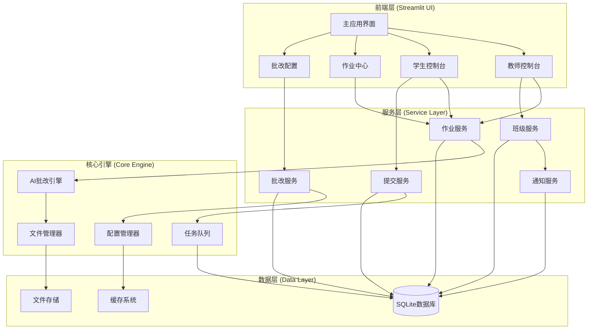
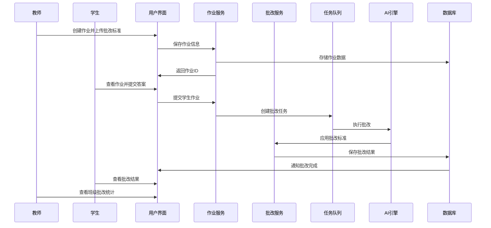

# 设计文档

## 概述

班级作业批改系统是基于现有AI智能批改平台的扩展功能，集成了完整的班级管理、作业发布、学生提交和自动批改流程。系统采用模块化设计，充分利用现有的AI批改引擎、任务队列系统和数据库架构，为教师和学生提供完整的作业管理和批改体验。

## 架构

### 系统架构图



### 数据流架构



## 组件和接口

### 1. 数据模型扩展

基于现有的数据库架构，扩展以下模型：

#### Assignment (作业模型)
```python
@dataclass
class Assignment:
    id: int
    class_id: int
    title: str
    description: str
    question_files: List[str]  # 作业题目文件路径
    marking_files: List[str]   # 批改标准文件路径
    grading_config_id: Optional[str]  # 关联的批改配置ID
    deadline: Optional[datetime]
    created_at: datetime
    is_active: bool
    
    # 统计信息
    submission_count: int = 0
    graded_count: int = 0
```

#### Submission (提交模型)
```python
@dataclass
class Submission:
    id: int
    assignment_id: int
    student_username: str
    answer_files: List[str]    # 学生答案文件路径
    ai_result: Optional[str]   # AI批改原始结果
    teacher_feedback: Optional[str]  # 教师修改后的反馈
    status: SubmissionStatus   # 提交状态
    score: Optional[float]     # 最终得分
    task_id: Optional[str]     # 关联的批改任务ID
    submitted_at: datetime
    graded_at: Optional[datetime]
    returned_at: Optional[datetime]
```

#### ClassroomGradingTask (班级批改任务模型)
```python
@dataclass
class ClassroomGradingTask:
    submission_id: int
    assignment_id: int
    student_username: str
    answer_files: List[str]
    marking_files: List[str]
    grading_config: Optional[GradingConfig]
    priority: TaskPriority = TaskPriority.NORMAL
```

### 2. 服务层组件

#### AssignmentService (作业服务)
```python
class AssignmentService:
    def create_assignment(self, class_id: int, title: str, description: str,
                         question_files: List[str], marking_files: List[str],
                         grading_config_id: Optional[str] = None,
                         deadline: Optional[datetime] = None) -> Optional[int]
    
    def get_class_assignments(self, class_id: int) -> List[Assignment]
    
    def get_student_assignments(self, student_username: str, 
                               class_id: Optional[int] = None) -> List[Assignment]
    
    def update_assignment(self, assignment_id: int, **kwargs) -> bool
    
    def delete_assignment(self, assignment_id: int) -> bool
    
    def get_assignment_statistics(self, assignment_id: int) -> Dict[str, Any]
```

#### SubmissionService (提交服务)
```python
class SubmissionService:
    def submit_assignment(self, assignment_id: int, student_username: str,
                         answer_files: List[str]) -> bool
    
    def get_submission(self, assignment_id: int, student_username: str) -> Optional[Submission]
    
    def get_assignment_submissions(self, assignment_id: int) -> List[Submission]
    
    def update_submission_feedback(self, submission_id: int, 
                                  teacher_feedback: str, score: Optional[float] = None) -> bool
    
    def get_submission_history(self, student_username: str) -> List[Submission]
```

#### ClassroomGradingService (班级批改服务)
```python
class ClassroomGradingService:
    def __init__(self, task_service: TaskService, 
                 grading_config_service: GradingConfigService,
                 ai_grading_engine: Any):
        self.task_service = task_service
        self.config_service = grading_config_service
        self.ai_engine = ai_grading_engine
    
    def trigger_auto_grading(self, submission: Submission) -> str
    
    def process_grading_task(self, task: Task) -> Dict[str, Any]
    
    def apply_grading_standards(self, content: str, marking_files: List[str],
                               grading_config: Optional[GradingConfig] = None) -> Dict[str, Any]
    
    def generate_grading_report(self, submission: Submission, 
                               grading_result: Dict[str, Any]) -> str
```

### 3. UI组件

#### AssignmentCenter (作业中心组件)
```python
class AssignmentCenter:
    def render_teacher_view(self, teacher_username: str)
    def render_student_view(self, student_username: str)
    def render_assignment_creation_form(self, class_id: int)
    def render_assignment_list(self, assignments: List[Assignment])
    def render_submission_management(self, assignment_id: int)
```

#### SubmissionInterface (提交界面组件)
```python
class SubmissionInterface:
    def render_assignment_details(self, assignment: Assignment)
    def render_file_upload_form(self, assignment_id: int)
    def render_submission_status(self, submission: Submission)
    def render_grading_results(self, submission: Submission)
```

#### GradingDashboard (批改仪表板组件)
```python
class GradingDashboard:
    def render_class_overview(self, class_id: int)
    def render_assignment_statistics(self, assignment_id: int)
    def render_grading_progress(self, assignment_id: int)
    def render_student_performance_analysis(self, class_id: int)
```

## 数据模型

### 数据库表结构扩展

基于现有的数据库架构，需要对以下表进行扩展：

#### assignments表扩展
```sql
ALTER TABLE assignments ADD COLUMN grading_config_id TEXT;
ALTER TABLE assignments ADD COLUMN auto_grading_enabled BOOLEAN DEFAULT 1;
ALTER TABLE assignments ADD COLUMN grading_template_id TEXT;
```

#### submissions表扩展
```sql
ALTER TABLE submissions ADD COLUMN task_id TEXT;
ALTER TABLE submissions ADD COLUMN grading_details TEXT; -- JSON格式存储详细批改信息
ALTER TABLE submissions ADD COLUMN ai_confidence REAL;   -- AI批改置信度
ALTER TABLE submissions ADD COLUMN manual_review_required BOOLEAN DEFAULT 0;
```

#### 新增表：grading_tasks
```sql
CREATE TABLE grading_tasks (
    id TEXT PRIMARY KEY,
    submission_id INTEGER NOT NULL,
    assignment_id INTEGER NOT NULL,
    student_username TEXT NOT NULL,
    status TEXT DEFAULT 'pending',
    created_at TIMESTAMP DEFAULT CURRENT_TIMESTAMP,
    started_at TIMESTAMP,
    completed_at TIMESTAMP,
    error_message TEXT,
    FOREIGN KEY (submission_id) REFERENCES submissions (id),
    FOREIGN KEY (assignment_id) REFERENCES assignments (id),
    FOREIGN KEY (student_username) REFERENCES users (username)
);
```

### 文件存储结构

```
uploads/
├── assignments/
│   ├── {assignment_id}/
│   │   ├── questions/          # 作业题目文件
│   │   │   ├── question_1.pdf
│   │   │   └── question_2.docx
│   │   └── marking_standards/  # 批改标准文件
│   │       ├── rubric.pdf
│   │       └── answer_key.docx
│   └── submissions/
│       └── {assignment_id}/
│           └── {student_username}/
│               ├── answer_1.pdf
│               ├── answer_2.docx
│               └── metadata.json
└── grading_results/
    └── {submission_id}/
        ├── ai_result.json      # AI批改原始结果
        ├── final_report.pdf    # 最终批改报告
        └── feedback.json       # 结构化反馈数据
```

## 错误处理

### 错误分类和处理策略

#### 1. 文件处理错误
- **文件上传失败**: 重试机制，文件格式验证
- **文件损坏**: 错误提示，要求重新上传
- **文件大小超限**: 前端验证，后端限制

#### 2. 批改处理错误
- **AI服务不可用**: 任务队列重试，降级到手动批改
- **批改标准解析失败**: 使用默认模板，通知教师
- **批改超时**: 任务重新调度，增加超时时间

#### 3. 数据一致性错误
- **提交状态不一致**: 数据库事务回滚，状态重置
- **文件引用丢失**: 文件完整性检查，自动修复

#### 4. 权限和安全错误
- **未授权访问**: 身份验证，权限检查
- **文件安全扫描**: 病毒检测，恶意文件拦截

### 错误恢复机制

```python
class ErrorRecoveryManager:
    def handle_grading_failure(self, task_id: str, error: Exception):
        """处理批改失败的恢复逻辑"""
        if isinstance(error, AIServiceUnavailableError):
            # AI服务不可用，延迟重试
            self.schedule_retry(task_id, delay=300)
        elif isinstance(error, FileProcessingError):
            # 文件处理错误，标记需要人工干预
            self.mark_for_manual_review(task_id)
        else:
            # 其他错误，记录日志并通知管理员
            self.log_error_and_notify(task_id, error)
    
    def recover_incomplete_submissions(self):
        """恢复未完成的提交"""
        incomplete_tasks = self.get_incomplete_grading_tasks()
        for task in incomplete_tasks:
            if self.can_retry(task):
                self.retry_grading_task(task.id)
            else:
                self.mark_as_failed(task.id)
```

## 测试策略

### 单元测试

#### 1. 服务层测试
```python
class TestAssignmentService:
    def test_create_assignment_with_grading_config(self):
        """测试创建带批改配置的作业"""
        
    def test_get_student_assignments_by_class(self):
        """测试获取学生班级作业列表"""
        
    def test_assignment_statistics_calculation(self):
        """测试作业统计数据计算"""

class TestSubmissionService:
    def test_submit_assignment_triggers_grading(self):
        """测试提交作业触发自动批改"""
        
    def test_update_submission_feedback(self):
        """测试更新提交反馈"""
        
    def test_submission_history_retrieval(self):
        """测试提交历史记录获取"""

class TestClassroomGradingService:
    def test_auto_grading_with_standards(self):
        """测试基于标准的自动批改"""
        
    def test_grading_without_standards(self):
        """测试无标准时的默认批改"""
        
    def test_grading_task_error_handling(self):
        """测试批改任务错误处理"""
```

#### 2. 数据模型测试
```python
class TestDataModels:
    def test_assignment_model_validation(self):
        """测试作业模型验证"""
        
    def test_submission_status_transitions(self):
        """测试提交状态转换"""
        
    def test_grading_task_lifecycle(self):
        """测试批改任务生命周期"""
```

### 集成测试

#### 1. 端到端工作流测试
```python
class TestClassroomWorkflow:
    def test_complete_assignment_workflow(self):
        """测试完整的作业流程：创建->提交->批改->反馈"""
        
    def test_multiple_students_submission(self):
        """测试多学生同时提交作业"""
        
    def test_teacher_feedback_modification(self):
        """测试教师修改批改反馈"""
```

#### 2. 性能测试
```python
class TestPerformance:
    def test_batch_grading_performance(self):
        """测试批量批改性能"""
        
    def test_concurrent_submissions(self):
        """测试并发提交处理"""
        
    def test_large_file_handling(self):
        """测试大文件处理性能"""
```

### 用户验收测试

#### 1. 教师用户场景
- 创建班级和作业
- 上传批改标准
- 查看学生提交
- 修改批改结果
- 导出成绩报告

#### 2. 学生用户场景
- 加入班级
- 查看作业要求
- 提交作业文件
- 查看批改结果
- 查看历史记录

#### 3. 系统管理场景
- 监控批改任务
- 处理错误恢复
- 系统性能监控
- 数据备份恢复

## 安全考虑

### 1. 文件安全
- **文件类型验证**: 严格限制上传文件类型
- **文件大小限制**: 防止存储空间滥用
- **病毒扫描**: 集成文件安全扫描
- **文件隔离**: 不同用户文件严格隔离

### 2. 数据安全
- **数据加密**: 敏感数据加密存储
- **访问控制**: 基于角色的权限控制
- **审计日志**: 完整的操作审计记录
- **数据备份**: 定期数据备份和恢复测试

### 3. 系统安全
- **输入验证**: 所有用户输入严格验证
- **SQL注入防护**: 使用参数化查询
- **XSS防护**: 输出内容转义处理
- **CSRF防护**: 请求令牌验证

### 4. 隐私保护
- **数据最小化**: 只收集必要的用户数据
- **匿名化处理**: 统计数据匿名化
- **数据保留策略**: 定期清理过期数据
- **用户同意**: 明确的隐私政策和用户同意

## 部署和运维

### 1. 部署架构
- **单机部署**: 适用于小规模使用
- **容器化部署**: 使用Docker进行标准化部署
- **负载均衡**: 支持多实例负载均衡
- **数据库集群**: 支持数据库读写分离

### 2. 监控和告警
- **系统监控**: CPU、内存、磁盘使用监控
- **应用监控**: 批改任务执行状态监控
- **错误告警**: 关键错误实时告警
- **性能指标**: 响应时间、吞吐量监控

### 3. 备份和恢复
- **数据备份**: 定期自动数据备份
- **文件备份**: 上传文件定期备份
- **灾难恢复**: 完整的灾难恢复方案
- **备份测试**: 定期备份恢复测试

### 4. 扩展性设计
- **水平扩展**: 支持多实例部署
- **缓存优化**: Redis缓存提升性能
- **异步处理**: 任务队列异步处理
- **微服务架构**: 支持服务拆分和独立部署