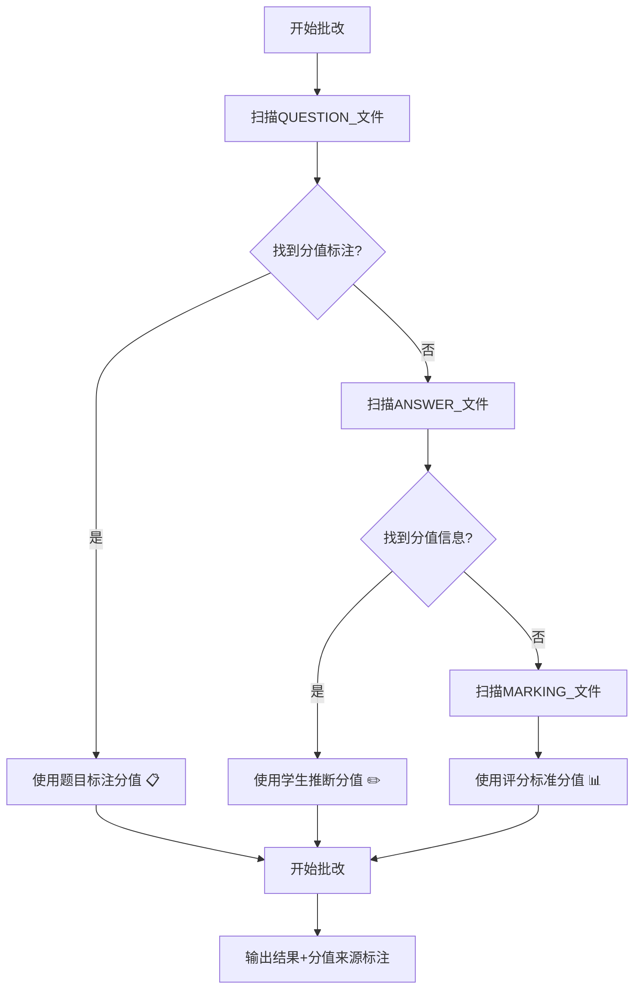

# 分值估算优先级系统

## 📋 系统概述

为了确保AI批改系统能够更准确地确定每道题的分值，我们实施了一个三级优先级的分值估算系统。这个系统避免了过度依赖评分标准而忽略实际题目要求的问题。

## 🎯 分值估算优先级

### 🥇 第一优先级：题目文件中的分值标注
- **数据源**：QUESTION_前缀文件
- **查找内容**：
  - (5分)、[3 marks]、3m、5分
  - Question 1 (8 marks)
  - 第1题（6分）
- **优势**：这是最权威、最准确的分值来源
- **标识**：📋 "分值来源：题目标注"

### 🥈 第二优先级：学生作答中的分值信息
- **数据源**：ANSWER_前缀文件
- **查找内容**：
  - 学生标注的分值："第1题(5分)"、"Question 1: 5 marks"
  - 从解题结构推断：分3个步骤可能是3分题
- **使用条件**：仅在题目文件无分值标注时使用
- **标识**：✏️ "分值来源：学生作答推断"

### 🥉 第三优先级：评分标准中的分值
- **数据源**：MARKING_前缀文件
- **查找内容**：M/A分值累加（如1M+1M+1A = 3分）
- **使用条件**：仅在前两者都无法获得分值时使用
- **注意**：⚠️ 谨慎使用，避免过度依赖评分标准
- **标识**：📊 "分值来源：评分标准参考"

## 🔄 执行流程



## ✅ 关键优势

### 1. **准确性提升**
- 优先使用题目中明确标注的分值
- 避免因评分标准与实际题目不符造成的误判
- 减少分值估算错误

### 2. **透明度增强**
- 每道题明确标注分值来源
- 批改结果可追溯、可验证
- 用户了解AI的分值判断依据

### 3. **灵活性保证**
- 支持多种分值标注格式
- 适应不同的题目和答题形式
- 向下兼容原有的评分标准模式

### 4. **错误防护**
- 三重验证机制防止分值错误
- 优先级机制避免过度依赖单一来源
- 强制标注分值来源便于检查

## 🛡️ 安全机制

### 分值验证检查表
- ✅ 是否按优先级顺序执行分值估算？
- ✅ 分值来源是否标注清楚？
- ✅ 估算结果是否合理？
- ✅ 没有跳过优先级步骤？
- ✅ 所有题目得分 ≤ 估算总分？

### 错误修正机制
1. 重新检查分值估算优先级
2. 立即重新计算超标题目
3. 选择合适的做法评分
4. 确保不超过估算总分
5. 重新验证总分

## 📊 输出格式示例

```
### 题目1
**满分**：5分 - 📋 分值来源：题目标注
**得分**：4分
**批改详情**：
- 建立方程组：✓ [1M]
- 求解过程：✓ [2M] 
- 最终答案：✗ [2A] → 计算错误，x应为6而非5

### 题目2  
**满分**：3分 - ✏️ 分值来源：学生作答推断
**得分**：3分
**批改详情**：
- 所有步骤正确：✓ [3分]

**总评**：
- 总分：7/8分
- 分值估算说明：优先使用题目标注📋，其次学生推断✏️，最后评分参考📊
- 主要问题：题目1计算错误
```

## 🔧 技术实现

### 在提示词中的体现
- `score_handling_rules`：定义分值估算优先级
- `score_calculation_constraints`：添加分值估算执行流程
- `internal_analysis_reminders`：强化AI内部分值估算机制
- `grading_output_format`：要求标注分值来源

### 关键函数
- `create_score_estimation_system()`：分值估算优先级系统
- `create_score_validation_system()`：分值验证安全系统
- `get_score_safety_prompt()`：综合分值安全提示词

## 🎓 使用效果

实施分值估算优先级系统后：

1. **AI更准确**：优先使用题目标注分值，减少误判
2. **结果更可信**：明确标注分值来源，增强透明度
3. **错误更少**：三级验证机制防止分值计算错误
4. **维护更容易**：问题可追溯到具体的分值来源

这个系统确保了AI批改的分值判断更加科学、准确和可靠！ 