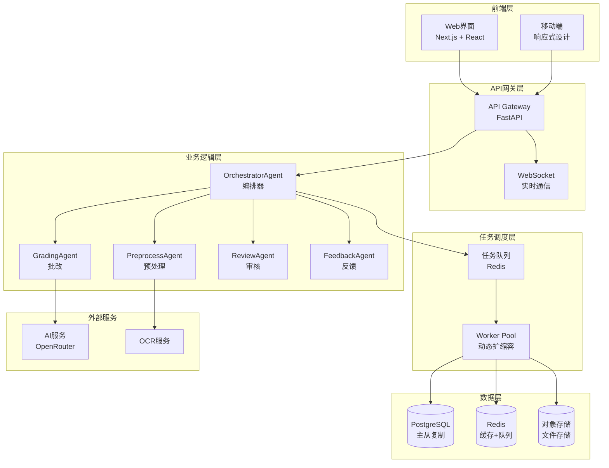

# AI自动批改系统 - 设计文档总览

## 📚 文档导航

欢迎来到AI自动批改系统的完整设计文档!本系列文档详细描述了基于LangChain/LangGraph的智能批改系统的设计、架构和实现细节。

---

## 📖 文档列表

### 1️⃣ [需求文档](./01_REQUIREMENTS_DOCUMENT.md)
**内容概要**:
- 系统概述与目标
- 用户角色与需求分析(教师、学生、管理员)
- 核心功能需求(作业管理、AI批改、任务调度、学习分析)
- 非功能性需求(性能、可靠性、可扩展性、安全性)
- 技术约束与成功标准
- 风险评估与项目里程碑

**适合阅读对象**: 产品经理、项目经理、开发团队、测试团队

**关键亮点**:
- ✅ 明确的用户故事和使用场景
- ✅ 量化的性能指标和成功标准
- ✅ 完整的风险评估和缓解策略

---

### 2️⃣ [Agent架构设计](./02_AGENT_ARCHITECTURE_DESIGN.md)
**内容概要**:
- LangGraph多Agent协作架构
- Agent类型与职责划分
  - OrchestratorAgent(编排器)
  - PreprocessAgent(预处理器)
  - GradingAgent(批改器)
  - ReviewAgent(审核器)
  - FeedbackAgent(反馈生成器)
- 状态管理与工作流设计
- Agent实现细节与代码示例

**适合阅读对象**: 架构师、后端开发工程师、AI工程师

**关键亮点**:
- ✅ 清晰的Agent层次结构
- ✅ 完整的状态机设计
- ✅ 可复用的Agent模式

---

### 3️⃣ [协作策略](./03_COLLABORATION_STRATEGY.md)
**内容概要**:
- Agent协作模式(线性Pipeline、并行处理、条件分支)
- 通信机制(状态共享、消息传递)
- 数据流转设计
- 错误处理与恢复策略
- 并发控制与限流机制

**适合阅读对象**: 后端开发工程师、系统架构师

**关键亮点**:
- ✅ 多种协作模式适应不同场景
- ✅ 完善的错误处理和重试机制
- ✅ 断点续传支持

---

### 4️⃣ [可扩展性与可靠性](./04_SCALABILITY_RELIABILITY.md)
**内容概要**:
- 水平扩展架构设计
- 分布式任务队列
- 动态Worker扩缩容
- 数据库读写分离与分片
- 数据一致性保障(分布式锁、幂等性)
- 故障恢复与自动恢复
- 高可用架构(服务降级、熔断器、限流)
- 性能优化(多级缓存)

**适合阅读对象**: 系统架构师、运维工程师、后端开发工程师

**关键亮点**:
- ✅ 支持水平扩展的架构
- ✅ 完整的可靠性保障机制
- ✅ 生产级的性能优化策略

---

### 5️⃣ [用户体验设计](./05_USER_EXPERIENCE_DESIGN.md)
**内容概要**:
- 教师端界面设计(作业管理、批改管理、结果审核)
- 学生端界面设计(作业提交、结果查看)
- 实时反馈机制(WebSocket、进度追踪、通知系统)
- 响应式设计与移动端适配
- 性能优化(虚拟滚动、图片懒加载)

**适合阅读对象**: 前端开发工程师、UI/UX设计师、产品经理

**关键亮点**:
- ✅ 完整的交互流程设计
- ✅ 实时反馈机制
- ✅ 移动端友好的响应式设计

---

### 6️⃣ [前端Mock实现](./06_FRONTEND_MOCK_IMPLEMENTATION.md)
**内容概要**:
- Mock数据结构设计
- Mock数据生成器(使用Faker.js)
- Mock API实现
- Mock WebSocket实现
- 开发工作流与Mock开关配置

**适合阅读对象**: 前端开发工程师

**关键亮点**:
- ✅ 完整的Mock数据模型
- ✅ 真实的Mock API行为(延迟、失败率)
- ✅ 便捷的开发模式切换

---

## 🎯 快速开始指南

### 第一次阅读建议

**如果你是...**

**产品经理/项目经理**:
1. 先读 [需求文档](./01_REQUIREMENTS_DOCUMENT.md) 了解整体需求
2. 再读 [用户体验设计](./05_USER_EXPERIENCE_DESIGN.md) 了解界面和交互

**架构师**:
1. 先读 [需求文档](./01_REQUIREMENTS_DOCUMENT.md) 了解业务需求
2. 再读 [Agent架构设计](./02_AGENT_ARCHITECTURE_DESIGN.md) 了解核心架构
3. 然后读 [协作策略](./03_COLLABORATION_STRATEGY.md) 了解Agent协作
4. 最后读 [可扩展性与可靠性](./04_SCALABILITY_RELIABILITY.md) 了解系统保障

**后端开发工程师**:
1. 先读 [Agent架构设计](./02_AGENT_ARCHITECTURE_DESIGN.md) 了解Agent实现
2. 再读 [协作策略](./03_COLLABORATION_STRATEGY.md) 了解通信机制
3. 然后读 [可扩展性与可靠性](./04_SCALABILITY_RELIABILITY.md) 了解系统设计

**前端开发工程师**:
1. 先读 [用户体验设计](./05_USER_EXPERIENCE_DESIGN.md) 了解界面设计
2. 再读 [前端Mock实现](./06_FRONTEND_MOCK_IMPLEMENTATION.md) 开始开发

**AI工程师**:
1. 先读 [Agent架构设计](./02_AGENT_ARCHITECTURE_DESIGN.md) 了解Agent设计
2. 再读 [协作策略](./03_COLLABORATION_STRATEGY.md) 了解工作流

---

## 🏗️ 系统架构概览

---

## 🔑 核心技术栈

### 后端
- **框架**: FastAPI (Python 3.11+)
- **AI框架**: LangChain, LangGraph
- **数据库**: PostgreSQL 15+
- **缓存**: Redis 7+
- **任务队列**: Redis Streams
- **AI模型**: OpenRouter API (Gemini 2.5 Flash Lite)

### 前端
- **框架**: Next.js 14+ (App Router)
- **UI库**: React 18+, TypeScript
- **状态管理**: Zustand / React Query
- **UI组件**: shadcn/ui, Tailwind CSS
- **实时通信**: WebSocket

### 基础设施
- **容器化**: Docker, Docker Compose
- **部署**: Railway / Vercel
- **CI/CD**: GitHub Actions
- **监控**: Prometheus + Grafana

---

## 📊 关键指标

### 性能指标
- **单份批改**: < 30秒
- **批量批改(100份)**: < 10分钟
- **API响应时间**: < 500ms
- **并发处理能力**: 100+ 任务

### 可靠性指标
- **系统可用性**: 99.9%
- **批改准确率**: > 90%
- **错误率**: < 0.1%

### 用户体验指标
- **页面加载时间**: < 2秒
- **实时反馈延迟**: < 1秒
- **移动端适配**: 100%

---

## 🚀 实施路线图

### Phase 1: 基础架构 (2周)
- [ ] 数据库模型设计与实现
- [ ] LangGraph Agent基础框架
- [ ] 任务队列系统
- [ ] 基础API开发

### Phase 2: 核心功能 (4周)
- [ ] PreprocessAgent实现
- [ ] GradingAgent实现
- [ ] ReviewAgent实现
- [ ] FeedbackAgent实现
- [ ] 批量批改功能
- [ ] 前端界面开发

### Phase 3: 高级功能 (3周)
- [ ] 学习分析模块
- [ ] 个性化建议
- [ ] 实时通知系统
- [ ] 数据导出功能

### Phase 4: 优化与测试 (2周)
- [ ] 性能优化
- [ ] 压力测试
- [ ] 安全加固
- [ ] 文档完善

### Phase 5: 上线与运维 (1周)
- [ ] 生产环境部署
- [ ] 监控告警配置
- [ ] 用户培训
- [ ] 持续优化

---

## 💡 设计原则

### 1. 单一职责原则
每个Agent专注于特定任务,职责清晰,易于维护和测试。

### 2. 松耦合设计
Agent之间通过消息传递通信,降低耦合度,提高灵活性。

### 3. 可观测性
每个步骤都有清晰的日志和状态,便于调试和监控。

### 4. 容错性
完善的错误处理、重试机制和降级策略,确保系统稳定性。

### 5. 可扩展性
模块化设计,易于添加新的Agent和功能,支持水平扩展。

### 6. 用户体验优先
实时反馈、清晰的界面、流畅的交互,提供优秀的用户体验。

---

## 🤝 贡献指南

### 文档更新
如果您发现文档中的问题或有改进建议,请:
1. 创建Issue描述问题
2. 提交Pull Request更新文档
3. 确保文档格式一致

### 代码实现
实现时请参考相应的设计文档,确保:
1. 遵循设计原则
2. 添加完整的注释
3. 编写单元测试
4. 更新相关文档

---

## 📞 联系方式

如有任何问题或建议,请通过以下方式联系:
- **Issue**: 在GitHub仓库创建Issue
- **Email**: [项目邮箱]
- **文档**: 查看相关设计文档

---

## 📝 更新日志

### v3.0 (2025-10-05)
- ✅ 完成完整的设计文档系列
- ✅ 添加LangGraph Agent架构设计
- ✅ 添加协作策略和可靠性设计
- ✅ 添加用户体验设计和Mock实现

### v2.0 (之前版本)
- 基础功能设计
- 初步架构规划

---

**祝您开发顺利!** 🎉

如有疑问,请随时查阅相关文档或联系团队成员。

