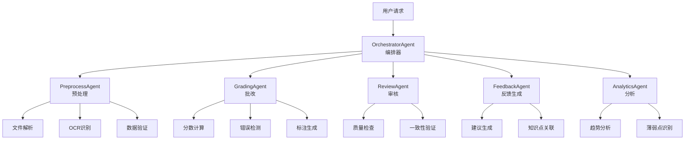

# Agent架构设计文档

## 📌 文档概述

本文档详细描述基于LangGraph的多Agent协作架构设计,包括Agent类型、职责、协作模式和实现细节。

---

## 1. 架构概览

### 1.1 设计理念

**核心原则**:
- **单一职责**: 每个Agent专注于特定任务
- **松耦合**: Agent之间通过消息传递通信
- **可组合**: Agent可以灵活组合成不同的工作流
- **可观测**: 每个步骤都有清晰的状态和日志
- **容错性**: 单个Agent失败不影响整体流程

**架构模式**: **Supervisor Pattern + Pipeline Pattern**
```
Orchestrator (Supervisor)
    ├── PreprocessAgent (Pipeline Step 1)
    ├── GradingAgent (Pipeline Step 2)
    ├── ReviewAgent (Pipeline Step 3)
    └── FeedbackAgent (Pipeline Step 4)
```

### 1.2 Agent层次结构



---

## 2. Agent详细设计

### 2.1 OrchestratorAgent (编排器)

**职责**: 整体流程编排、任务分发、状态管理

**输入**:
```python
{
    "task_type": "single_grading" | "batch_grading",
    "submission_id": UUID,
    "assignment_id": UUID,
    "config": {
        "strictness": "loose" | "standard" | "strict",
        "enable_review": bool,
        "enable_analytics": bool
    }
}
```

**核心逻辑**:
```python
class OrchestratorAgent:
    """编排器Agent - 负责整体流程控制"""
    
    def __init__(self, llm, tools):
        self.llm = llm
        self.tools = tools
        self.state_graph = self._build_graph()
    
    def _build_graph(self) -> StateGraph:
        """构建LangGraph工作流"""
        workflow = StateGraph(GradingState)
        
        # 添加节点
        workflow.add_node("preprocess", self.preprocess_step)
        workflow.add_node("grade", self.grade_step)
        workflow.add_node("review", self.review_step)
        workflow.add_node("feedback", self.feedback_step)
        workflow.add_node("finalize", self.finalize_step)
        
        # 定义边和条件
        workflow.set_entry_point("preprocess")
        workflow.add_edge("preprocess", "grade")
        workflow.add_conditional_edges(
            "grade",
            self.should_review,
            {
                "review": "review",
                "feedback": "feedback"
            }
        )
        workflow.add_edge("review", "feedback")
        workflow.add_edge("feedback", "finalize")
        workflow.set_finish_point("finalize")
        
        return workflow.compile()
    
    async def execute(self, input_data: Dict) -> Dict:
        """执行批改流程"""
        initial_state = GradingState(
            submission_id=input_data["submission_id"],
            status="pending",
            config=input_data["config"]
        )
        
        result = await self.state_graph.ainvoke(initial_state)
        return result
    
    def should_review(self, state: GradingState) -> str:
        """决定是否需要审核"""
        if state.config.get("enable_review") and state.confidence < 0.8:
            return "review"
        return "feedback"
```

**状态管理**:
```python
class GradingState(TypedDict):
    """批改流程状态"""
    submission_id: UUID
    assignment_id: UUID
    status: str  # pending, preprocessing, grading, reviewing, completed, failed
    
    # 预处理结果
    preprocessed_files: List[Dict]
    extracted_text: str
    file_metadata: Dict
    
    # 批改结果
    score: Optional[float]
    max_score: float
    errors: List[Dict]
    annotations: List[Dict]
    confidence: float
    
    # 审核结果
    review_passed: bool
    review_comments: str
    adjusted_score: Optional[float]
    
    # 反馈结果
    feedback_text: str
    suggestions: List[str]
    knowledge_points: List[str]
    
    # 元数据
    config: Dict
    created_at: datetime
    updated_at: datetime
    error_message: Optional[str]
```

**输出**:
```python
{
    "submission_id": UUID,
    "status": "completed",
    "result": {
        "score": 85.5,
        "max_score": 100,
        "feedback": "整体完成良好...",
        "errors": [...],
        "annotations": [...],
        "suggestions": [...]
    },
    "metadata": {
        "processing_time_ms": 2500,
        "confidence": 0.92,
        "review_passed": true
    }
}
```

---

### 2.2 PreprocessAgent (预处理器)

**职责**: 文件解析、OCR识别、数据验证、格式转换

**核心功能**:
```python
class PreprocessAgent:
    """预处理Agent"""
    
    async def process(self, state: GradingState) -> GradingState:
        """预处理流程"""
        # 1. 获取文件
        files = await self._fetch_files(state.submission_id)
        
        # 2. 文件类型检测
        file_types = [self._detect_file_type(f) for f in files]
        
        # 3. 根据类型处理
        processed_files = []
        for file, file_type in zip(files, file_types):
            if file_type == "image":
                result = await self._process_image(file)
            elif file_type == "pdf":
                result = await self._process_pdf(file)
            elif file_type == "document":
                result = await self._process_document(file)
            else:
                raise ValueError(f"Unsupported file type: {file_type}")
            
            processed_files.append(result)
        
        # 4. 提取文本
        extracted_text = self._extract_text(processed_files)
        
        # 5. 数据验证
        validation_result = self._validate_data(extracted_text)
        if not validation_result.is_valid:
            state.status = "failed"
            state.error_message = validation_result.error
            return state
        
        # 6. 更新状态
        state.preprocessed_files = processed_files
        state.extracted_text = extracted_text
        state.status = "preprocessed"
        
        return state
    
    async def _process_image(self, file: File) -> Dict:
        """处理图片文件"""
        # OCR识别
        ocr_result = await self.ocr_service.recognize(file.path)
        
        # 图像增强
        enhanced_image = await self.image_enhancer.enhance(file.path)
        
        return {
            "file_id": file.id,
            "type": "image",
            "text": ocr_result.text,
            "confidence": ocr_result.confidence,
            "enhanced_path": enhanced_image.path,
            "metadata": {
                "width": enhanced_image.width,
                "height": enhanced_image.height,
                "format": enhanced_image.format
            }
        }
    
    async def _process_pdf(self, file: File) -> Dict:
        """处理PDF文件"""
        # 转换为图片
        images = await self.pdf_converter.to_images(file.path)
        
        # 提取文本
        text = await self.pdf_parser.extract_text(file.path)
        
        return {
            "file_id": file.id,
            "type": "pdf",
            "text": text,
            "images": images,
            "page_count": len(images)
        }
```

**工具集成**:
- **OCR**: Tesseract / PaddleOCR / 云服务API
- **PDF处理**: PyPDF2 / pdfplumber
- **图像处理**: Pillow / OpenCV
- **文档解析**: python-docx / openpyxl

---

### 2.3 GradingAgent (批改器)

**职责**: 核心批改逻辑、分数计算、错误检测、标注生成

**核心实现**:
```python
class GradingAgent:
    """批改Agent - 核心批改逻辑"""
    
    def __init__(self, llm, grading_prompts):
        self.llm = llm
        self.prompts = grading_prompts
        self.error_detector = ErrorDetector()
        self.score_calculator = ScoreCalculator()
        self.annotation_generator = AnnotationGenerator()
    
    async def process(self, state: GradingState) -> GradingState:
        """执行批改"""
        # 1. 获取批改标准
        assignment = await self._get_assignment(state.assignment_id)
        grading_standard = assignment.grading_standard
        
        # 2. 构建批改提示词
        prompt = self._build_grading_prompt(
            student_answer=state.extracted_text,
            grading_standard=grading_standard,
            config=state.config
        )
        
        # 3. 调用LLM进行批改
        grading_result = await self.llm.ainvoke(prompt)
        
        # 4. 解析批改结果
        parsed_result = self._parse_grading_result(grading_result)
        
        # 5. 错误检测
        errors = await self.error_detector.detect(
            student_answer=state.extracted_text,
            standard_answer=grading_standard.answer,
            llm_errors=parsed_result.errors
        )
        
        # 6. 分数计算
        score = self.score_calculator.calculate(
            errors=errors,
            max_score=assignment.max_score,
            strictness=state.config.get("strictness", "standard")
        )
        
        # 7. 生成标注
        annotations = await self.annotation_generator.generate(
            errors=errors,
            files=state.preprocessed_files
        )
        
        # 8. 更新状态
        state.score = score.value
        state.max_score = assignment.max_score
        state.errors = errors
        state.annotations = annotations
        state.confidence = parsed_result.confidence
        state.status = "graded"
        
        return state
    
    def _build_grading_prompt(self, student_answer, grading_standard, config):
        """构建批改提示词"""
        strictness = config.get("strictness", "standard")
        
        prompt = f"""
你是一位专业的教师,正在批改学生作业。

【批改标准】
{grading_standard.criteria}

【标准答案】
{grading_standard.answer}

【学生答案】
{student_answer}

【批改要求】
- 严格程度: {strictness}
- 请逐项对照标准答案,找出学生答案中的错误
- 对每个错误,请说明:
  1. 错误类型(概念错误/计算错误/表述错误等)
  2. 错误位置(具体在哪一部分)
  3. 错误原因
  4. 正确答案应该是什么
- 请给出总体评价和改进建议

【输出格式】
请以JSON格式输出,包含以下字段:
{{
    "score": 分数(0-100),
    "confidence": 置信度(0-1),
    "errors": [
        {{
            "type": "错误类型",
            "location": "错误位置描述",
            "description": "错误说明",
            "correct_answer": "正确答案",
            "severity": "high|medium|low"
        }}
    ],
    "overall_comment": "总体评价",
    "strengths": ["优点1", "优点2"],
    "weaknesses": ["不足1", "不足2"]
}}
"""
        return prompt
```

**分数计算策略**:
```python
class ScoreCalculator:
    """分数计算器"""
    
    def calculate(self, errors, max_score, strictness):
        """计算分数"""
        # 基础分数
        base_score = max_score
        
        # 根据错误扣分
        for error in errors:
            deduction = self._calculate_deduction(error, strictness)
            base_score -= deduction
        
        # 确保分数在有效范围内
        final_score = max(0, min(base_score, max_score))
        
        return Score(
            value=final_score,
            max_value=max_score,
            percentage=final_score / max_score * 100
        )
    
    def _calculate_deduction(self, error, strictness):
        """计算单个错误的扣分"""
        # 基础扣分
        base_deduction = {
            "high": 10,
            "medium": 5,
            "low": 2
        }[error.severity]
        
        # 严格度调整
        strictness_multiplier = {
            "loose": 0.7,
            "standard": 1.0,
            "strict": 1.3
        }[strictness]
        
        return base_deduction * strictness_multiplier
```

---

### 2.4 ReviewAgent (审核器)

**职责**: 质量检查、一致性验证、置信度评估

**实现**:
```python
class ReviewAgent:
    """审核Agent - 质量控制"""
    
    async def process(self, state: GradingState) -> GradingState:
        """审核批改结果"""
        # 1. 置信度检查
        if state.confidence < 0.6:
            state.review_passed = False
            state.review_comments = "批改置信度过低,建议人工复核"
            return state
        
        # 2. 一致性检查
        consistency_check = await self._check_consistency(state)
        if not consistency_check.passed:
            state.review_passed = False
            state.review_comments = consistency_check.reason
            return state
        
        # 3. 合理性检查
        reasonableness_check = self._check_reasonableness(state)
        if not reasonableness_check.passed:
            # 调整分数
            state.adjusted_score = reasonableness_check.suggested_score
            state.review_comments = reasonableness_check.reason
        
        # 4. 通过审核
        state.review_passed = True
        state.status = "reviewed"
        
        return state
    
    async def _check_consistency(self, state):
        """一致性检查"""
        # 检查分数与错误数量是否匹配
        expected_score = self._estimate_score_from_errors(state.errors)
        score_diff = abs(state.score - expected_score)
        
        if score_diff > 10:
            return ConsistencyResult(
                passed=False,
                reason=f"分数({state.score})与错误数量不匹配,预期约{expected_score}分"
            )
        
        return ConsistencyResult(passed=True)
```

---

## 3. Agent协作模式

### 3.1 通信机制

**消息传递**:
```python
class AgentMessage(BaseModel):
    """Agent间消息"""
    from_agent: str
    to_agent: str
    message_type: str  # request, response, notification
    payload: Dict[str, Any]
    timestamp: datetime
    correlation_id: UUID  # 用于追踪整个流程
```

**状态共享**:
- 使用LangGraph的State机制
- 每个Agent读取和更新共享状态
- 状态变更自动触发下游Agent

### 3.2 错误处理

**重试策略**:
```python
class RetryConfig:
    max_retries: int = 3
    retry_delay: int = 5  # seconds
    backoff_multiplier: float = 2.0
    retry_on_errors: List[Type[Exception]] = [
        TimeoutError,
        ConnectionError,
        APIError
    ]
```

**降级策略**:
- ReviewAgent失败 → 跳过审核,直接生成反馈
- AnalyticsAgent失败 → 返回基础批改结果
- 整体失败 → 标记为待人工处理

---

## 4. 性能优化

### 4.1 并发处理
```python
# 批量批改时并发执行
async def batch_grade(submission_ids):
    tasks = [
        orchestrator.execute({"submission_id": sid})
        for sid in submission_ids
    ]
    results = await asyncio.gather(*tasks, return_exceptions=True)
    return results
```

### 4.2 缓存策略
- **LLM响应缓存**: 相同输入缓存结果
- **文件处理缓存**: OCR结果缓存
- **批改标准缓存**: 避免重复查询

---

## 5. 成本优化考虑 💰

### 5.1 成本分析

**重要提示**: 虽然设计了5个Agent,但实际上只有1-2个Agent会调用LLM API:

| Agent | 是否调用LLM | 单次成本 | 说明 |
|-------|------------|---------|------|
| OrchestratorAgent | ❌ | $0 | 纯流程控制 |
| PreprocessAgent | ❌ | $0 | 文件处理、OCR |
| **GradingAgent** | ✅ | **$0.008-0.015** | 主要成本来源 |
| ReviewAgent | ❌ | $0 | 规则验证、逻辑检查 |
| **FeedbackAgent** | ⚠️ 可选 | **$0.002-0.005** | 可选LLM调用 |

**单次批改总成本**: $0.010 - $0.015 (约¥0.07 - ¥0.10)

**月度成本估算** (假设每天1000次批改):
- 基础模式: $0.008 × 1000 × 30 = **$240/月** (约¥1,680/月)
- 标准模式: $0.010 × 1000 × 30 = **$300/月** (约¥2,100/月)
- 完整模式: $0.015 × 1000 × 30 = **$450/月** (约¥3,150/月)

### 5.2 优化方案

#### 方案1: Agent融合 (推荐 ⭐)

将GradingAgent和FeedbackAgent合并为一个UnifiedAgent,一次LLM调用完成所有任务:

```python
class UnifiedGradingAgent:
    """统一批改Agent - 一次LLM调用完成批改+反馈"""

    async def process(self, state: GradingState) -> GradingState:
        # 构建统一提示词,一次性完成批改和反馈生成
        prompt = f"""
请完成以下批改任务:

【批改标准】{state["grading_standard"]}
【学生答案】{state["extracted_text"]}

请一次性完成:
1. 批改评分 - 找出错误,计算分数
2. 错误分析 - 详细说明每个错误
3. 总体反馈 - 优点、不足、改进建议
4. 知识点关联 - 相关知识点和学习建议

输出JSON格式:
{{
    "score": ...,
    "errors": [...],
    "feedback": "...",
    "suggestions": [...],
    "knowledge_points": [...]
}}
"""
        response = await self.llm.ainvoke(prompt)
        return self._parse_unified_result(response, state)
```

**成本对比**:
- 原设计: GradingAgent($0.008) + FeedbackAgent($0.005) = $0.013
- 优化后: UnifiedAgent($0.010) = $0.010
- **节省: 23%**

#### 方案2: 智能模式选择

根据任务复杂度动态选择Agent组合:

```python
class SmartOrchestrator:
    """智能编排器 - 根据场景选择Agent组合"""

    async def execute(self, input_data: Dict) -> Dict:
        # 评估任务复杂度
        complexity = await self._assess_complexity(input_data)

        if complexity == "simple":
            # 快速模式: 使用UnifiedAgent (成本: $0.005)
            return await self.unified_agent.process(input_data)

        elif complexity == "medium":
            # 标准模式: 批改 + 规则审核 (成本: $0.009)
            state = await self.grading_agent.process(input_data)
            state = await self.review_agent.process(state)  # 不调用LLM
            return state

        else:  # complex
            # 完整模式: 使用所有Agent (成本: $0.015)
            return await self.full_pipeline(input_data)

    async def _assess_complexity(self, input_data: Dict) -> str:
        """评估任务复杂度"""
        # 简单任务: 单文件、小尺寸、基础题目
        if (input_data["file_count"] == 1 and
            input_data["file_size"] < 1_000_000 and
            input_data["question_count"] <= 3):
            return "simple"

        # 复杂任务: 多文件、大尺寸、复杂题目
        elif (input_data["file_count"] > 3 or
              input_data["file_size"] > 5_000_000 or
              input_data["question_count"] > 10):
            return "complex"

        return "medium"
```

**成本节省**: 平均 **40-50%**

#### 方案3: 批量处理

将多份作业合并到一次LLM调用:

```python
class BatchGradingAgent:
    """批量批改Agent"""

    async def batch_process(self, submissions: List[GradingState]) -> List[GradingState]:
        # 构建批量提示词
        prompt = self._build_batch_prompt(submissions[:5])  # 每次处理5份

        # 一次LLM调用处理多份作业
        response = await self.llm.ainvoke(prompt)

        # 解析批量结果
        return self._parse_batch_results(response)
```

**成本对比**:
- 原设计: 5份作业 × $0.010 = $0.050
- 批量处理: 1次调用 = $0.020
- **节省: 60%**

#### 方案4: 智能缓存

缓存相似问题的批改结果:

```python
@cache_similar(similarity_threshold=0.85)
async def grade_submission(submission_id: UUID):
    return await grading_agent.process(submission_id)
```

**成本节省**: 假设缓存命中率30%,节省 **30%**

### 5.3 推荐实施策略

**阶段1: 立即实施** (节省 ~40%)
- ✅ 实现UnifiedGradingAgent
- ✅ 添加智能模式选择
- ✅ 添加相似度缓存

**阶段2: 中期优化** (节省 ~60%)
- ⚪ 实现批量处理
- ⚪ 使用更便宜的模型(简单任务用gpt-3.5-turbo)

**阶段3: 长期优化** (节省 ~80%)
- ⚪ 训练专用模型
- ⚪ 混合使用自有模型和API

### 5.4 成本对比总结

| 方案 | 单次成本 | 月度成本 | 节省比例 | 实施难度 |
|------|---------|---------|---------|---------|
| 原设计(完整) | $0.015 | $450 | 0% | - |
| Agent融合 | $0.010 | $300 | 33% | ⭐ 简单 |
| + 智能模式 | $0.009 | $270 | 40% | ⭐ 简单 |
| + 批量处理 | $0.006 | $180 | 60% | ⭐⭐ 中等 |
| + 智能缓存 | $0.004 | $120 | 73% | ⭐⭐ 中等 |

**详细的成本优化策略请参考**: [09_COST_OPTIMIZATION_STRATEGY.md](./09_COST_OPTIMIZATION_STRATEGY.md)

---

## 6. 总结

本文档详细设计了基于LangGraph的多Agent协作架构,包括:

1. **清晰的Agent层次结构**: OrchestratorAgent作为编排器,协调其他专业Agent
2. **完善的状态管理**: 使用TypedDict定义状态,确保类型安全
3. **灵活的工作流**: 支持条件分支、并行处理等复杂场景
4. **可扩展的设计**: 易于添加新的Agent节点
5. **成本可控**: 实际只有1-2个Agent调用LLM,单次成本约$0.010,通过优化可降低40-60%

**下一步**:
- 阅读 [03_COLLABORATION_STRATEGY.md](./03_COLLABORATION_STRATEGY.md) 了解Agent协作策略
- 阅读 [09_COST_OPTIMIZATION_STRATEGY.md](./09_COST_OPTIMIZATION_STRATEGY.md) 了解详细的成本优化方案
- 阅读 [07_IMPLEMENTATION_GUIDE.md](./07_IMPLEMENTATION_GUIDE.md) 开始实现

---

**文档完成!** 🎉
