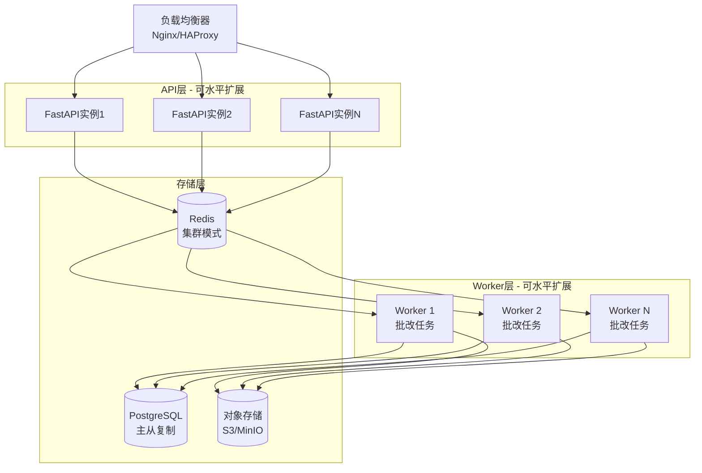

# 可扩展性与可靠性设计文档

## 📌 文档概述

本文档详细描述系统的可扩展性设计、可靠性保障、高可用架构和性能优化策略。

---

## 1. 可扩展性设计

### 1.1 水平扩展架构



### 1.2 任务队列扩展

**分布式任务队列**:
```python
class DistributedTaskQueue:
    """分布式任务队列"""
    
    def __init__(self, redis_cluster):
        self.redis = redis_cluster
        self.queue_prefix = "task_queue"
        self.worker_id = f"worker-{uuid4()}"
    
    async def enqueue(
        self,
        task: TaskDefinition,
        queue_name: str = "default"
    ) -> UUID:
        """入队任务"""
        queue_key = f"{self.queue_prefix}:{queue_name}"
        
        # 使用Redis Sorted Set实现优先级队列
        await self.redis.zadd(
            queue_key,
            {task.json(): task.priority.value}
        )
        
        # 发布任务通知
        await self.redis.publish(
            f"task_notification:{queue_name}",
            task.id.hex
        )
        
        return task.id
    
    async def dequeue(
        self,
        queue_name: str = "default",
        timeout: int = 30
    ) -> Optional[TaskDefinition]:
        """出队任务(阻塞式)"""
        queue_key = f"{self.queue_prefix}:{queue_name}"
        
        # 使用ZPOPMAX获取最高优先级任务
        result = await self.redis.zpopmax(queue_key)
        
        if result:
            task_json, priority = result[0]
            task = TaskDefinition(**json.loads(task_json))
            
            # 标记为处理中
            await self._mark_processing(task)
            
            return task
        
        return None
    
    async def _mark_processing(self, task: TaskDefinition):
        """标记任务为处理中"""
        processing_key = f"processing:{self.worker_id}:{task.id}"
        await self.redis.setex(
            processing_key,
            task.timeout,
            task.json()
        )
    
    async def complete_task(self, task_id: UUID, result: Dict):
        """完成任务"""
        processing_key = f"processing:{self.worker_id}:{task_id}"
        await self.redis.delete(processing_key)
        
        # 存储结果
        result_key = f"result:{task_id}"
        await self.redis.setex(
            result_key,
            86400,  # 24小时
            json.dumps(result, default=str)
        )
```

**动态Worker扩展**:
```python
class WorkerPool:
    """Worker池 - 支持动态扩缩容"""
    
    def __init__(
        self,
        min_workers: int = 3,
        max_workers: int = 20,
        scale_up_threshold: float = 0.8,
        scale_down_threshold: float = 0.3
    ):
        self.min_workers = min_workers
        self.max_workers = max_workers
        self.scale_up_threshold = scale_up_threshold
        self.scale_down_threshold = scale_down_threshold
        
        self.workers: List[asyncio.Task] = []
        self.task_queue = DistributedTaskQueue()
        self.running = False
    
    async def start(self):
        """启动Worker池"""
        self.running = True
        
        # 启动最小数量的Worker
        for i in range(self.min_workers):
            await self._spawn_worker(f"worker-{i}")
        
        # 启动自动扩缩容监控
        asyncio.create_task(self._auto_scale())
    
    async def _spawn_worker(self, worker_id: str):
        """创建Worker"""
        worker = asyncio.create_task(self._worker_loop(worker_id))
        self.workers.append(worker)
        logger.info(f"Spawned worker: {worker_id}")
    
    async def _worker_loop(self, worker_id: str):
        """Worker主循环"""
        while self.running:
            try:
                # 获取任务
                task = await self.task_queue.dequeue(timeout=30)
                
                if task:
                    # 处理任务
                    result = await self._process_task(task)
                    await self.task_queue.complete_task(task.id, result)
                
            except Exception as e:
                logger.error(f"Worker {worker_id} error: {e}")
                await asyncio.sleep(5)
    
    async def _auto_scale(self):
        """自动扩缩容"""
        while self.running:
            try:
                # 获取队列长度和Worker负载
                queue_length = await self.task_queue.get_queue_length()
                active_workers = len([w for w in self.workers if not w.done()])
                
                # 计算负载率
                if active_workers > 0:
                    load_ratio = queue_length / active_workers
                else:
                    load_ratio = float('inf')
                
                # 扩容
                if load_ratio > self.scale_up_threshold and active_workers < self.max_workers:
                    new_worker_id = f"worker-{len(self.workers)}"
                    await self._spawn_worker(new_worker_id)
                    logger.info(f"Scaled up: {active_workers} -> {active_workers + 1}")
                
                # 缩容
                elif load_ratio < self.scale_down_threshold and active_workers > self.min_workers:
                    # 停止一个Worker
                    worker = self.workers.pop()
                    worker.cancel()
                    logger.info(f"Scaled down: {active_workers} -> {active_workers - 1}")
                
                await asyncio.sleep(30)  # 每30秒检查一次
                
            except Exception as e:
                logger.error(f"Auto-scale error: {e}")
                await asyncio.sleep(60)
```

### 1.3 数据库扩展

**读写分离**:
```python
class DatabaseRouter:
    """数据库路由 - 读写分离"""
    
    def __init__(self):
        self.master_url = settings.DATABASE_MASTER_URL
        self.replica_urls = settings.DATABASE_REPLICA_URLS
        self.current_replica_index = 0
    
    def get_write_engine(self):
        """获取写库连接"""
        return create_async_engine(self.master_url)
    
    def get_read_engine(self):
        """获取读库连接(轮询)"""
        if not self.replica_urls:
            return self.get_write_engine()
        
        # 轮询选择从库
        replica_url = self.replica_urls[self.current_replica_index]
        self.current_replica_index = (self.current_replica_index + 1) % len(self.replica_urls)
        
        return create_async_engine(replica_url)

# 使用
class GradingService:
    async def create_task(self, task_data: GradingTaskCreate):
        """创建任务(写操作)"""
        async with get_db_session(write=True) as db:
            task = GradingTask(**task_data.dict())
            db.add(task)
            await db.commit()
            return task
    
    async def get_task(self, task_id: UUID):
        """获取任务(读操作)"""
        async with get_db_session(write=False) as db:
            result = await db.execute(
                select(GradingTask).where(GradingTask.id == task_id)
            )
            return result.scalar_one_or_none()
```

**分片策略**:
```python
class ShardingStrategy:
    """分片策略"""
    
    @staticmethod
    def get_shard_key(user_id: UUID) -> int:
        """根据用户ID计算分片键"""
        # 使用一致性哈希
        return int(hashlib.md5(user_id.bytes).hexdigest(), 16) % 10
    
    @staticmethod
    def get_database_url(shard_key: int) -> str:
        """根据分片键获取数据库URL"""
        shard_urls = settings.DATABASE_SHARD_URLS
        return shard_urls[shard_key]
```

---

## 2. 可靠性保障

### 2.1 数据一致性

**分布式锁**:
```python
class DistributedLock:
    """基于Redis的分布式锁"""
    
    def __init__(self, redis_client, key: str, timeout: int = 30):
        self.redis = redis_client
        self.key = f"lock:{key}"
        self.timeout = timeout
        self.lock_id = str(uuid4())
    
    async def __aenter__(self):
        """获取锁"""
        while True:
            # 尝试获取锁
            acquired = await self.redis.set(
                self.key,
                self.lock_id,
                nx=True,  # 只在键不存在时设置
                ex=self.timeout
            )
            
            if acquired:
                return self
            
            # 等待后重试
            await asyncio.sleep(0.1)
    
    async def __aexit__(self, exc_type, exc_val, exc_tb):
        """释放锁"""
        # 使用Lua脚本确保原子性
        lua_script = """
        if redis.call("get", KEYS[1]) == ARGV[1] then
            return redis.call("del", KEYS[1])
        else
            return 0
        end
        """
        await self.redis.eval(lua_script, 1, self.key, self.lock_id)

# 使用
async def update_submission_score(submission_id: UUID, score: float):
    """更新提交分数(防止并发冲突)"""
    async with DistributedLock(redis_client, f"submission:{submission_id}"):
        # 读取当前数据
        submission = await get_submission(submission_id)
        
        # 更新分数
        submission.score = score
        submission.updated_at = datetime.utcnow()
        
        # 保存
        await save_submission(submission)
```

**幂等性设计**:
```python
class IdempotencyManager:
    """幂等性管理器"""
    
    def __init__(self, redis_client):
        self.redis = redis_client
    
    async def is_processed(self, idempotency_key: str) -> bool:
        """检查请求是否已处理"""
        key = f"idempotency:{idempotency_key}"
        return await self.redis.exists(key)
    
    async def mark_processed(
        self,
        idempotency_key: str,
        result: Dict,
        ttl: int = 86400
    ):
        """标记请求已处理"""
        key = f"idempotency:{idempotency_key}"
        await self.redis.setex(
            key,
            ttl,
            json.dumps(result, default=str)
        )
    
    async def get_result(self, idempotency_key: str) -> Optional[Dict]:
        """获取已处理请求的结果"""
        key = f"idempotency:{idempotency_key}"
        data = await self.redis.get(key)
        return json.loads(data) if data else None

# 使用
@app.post("/api/v1/grading/submit")
async def submit_grading(
    request: GradingRequest,
    idempotency_key: str = Header(None)
):
    """提交批改请求(幂等)"""
    if not idempotency_key:
        idempotency_key = str(uuid4())
    
    # 检查是否已处理
    if await idempotency_manager.is_processed(idempotency_key):
        result = await idempotency_manager.get_result(idempotency_key)
        return result
    
    # 处理请求
    result = await grading_service.submit(request)
    
    # 标记已处理
    await idempotency_manager.mark_processed(idempotency_key, result)
    
    return result
```

### 2.2 故障恢复

**健康检查**:
```python
class HealthChecker:
    """健康检查器"""
    
    async def check_database(self) -> bool:
        """检查数据库连接"""
        try:
            async with get_db_session() as db:
                await db.execute(text("SELECT 1"))
            return True
        except Exception as e:
            logger.error(f"Database health check failed: {e}")
            return False
    
    async def check_redis(self) -> bool:
        """检查Redis连接"""
        try:
            await redis_client.ping()
            return True
        except Exception as e:
            logger.error(f"Redis health check failed: {e}")
            return False
    
    async def check_ai_service(self) -> bool:
        """检查AI服务"""
        try:
            # 发送测试请求
            response = await ai_service.health_check()
            return response.status == "ok"
        except Exception as e:
            logger.error(f"AI service health check failed: {e}")
            return False
    
    async def get_health_status(self) -> Dict:
        """获取整体健康状态"""
        checks = await asyncio.gather(
            self.check_database(),
            self.check_redis(),
            self.check_ai_service(),
            return_exceptions=True
        )
        
        return {
            "status": "healthy" if all(checks) else "unhealthy",
            "checks": {
                "database": checks[0],
                "redis": checks[1],
                "ai_service": checks[2]
            },
            "timestamp": datetime.utcnow().isoformat()
        }

# API端点
@app.get("/health")
async def health_check():
    """健康检查端点"""
    health_checker = HealthChecker()
    status = await health_checker.get_health_status()
    
    status_code = 200 if status["status"] == "healthy" else 503
    return JSONResponse(content=status, status_code=status_code)
```

**自动恢复**:
```python
class AutoRecovery:
    """自动恢复机制"""
    
    async def recover_failed_tasks(self):
        """恢复失败的任务"""
        # 查找失败的任务
        async with get_db_session() as db:
            result = await db.execute(
                select(GradingTask)
                .where(GradingTask.status == GradingTaskStatus.FAILED)
                .where(GradingTask.retry_count < 3)
            )
            failed_tasks = result.scalars().all()
        
        # 重新入队
        for task in failed_tasks:
            await task_queue.enqueue_task(
                task_name="grading_task",
                payload={"task_id": str(task.id)},
                priority=TaskPriority.HIGH
            )
            
            # 更新重试次数
            task.retry_count += 1
            task.status = GradingTaskStatus.PENDING
            await db.commit()
        
        logger.info(f"Recovered {len(failed_tasks)} failed tasks")
    
    async def recover_stuck_tasks(self):
        """恢复卡住的任务"""
        # 查找长时间处理中的任务
        timeout_threshold = datetime.utcnow() - timedelta(minutes=30)
        
        async with get_db_session() as db:
            result = await db.execute(
                select(GradingTask)
                .where(GradingTask.status == GradingTaskStatus.PROCESSING)
                .where(GradingTask.updated_at < timeout_threshold)
            )
            stuck_tasks = result.scalars().all()
        
        # 重置状态并重新入队
        for task in stuck_tasks:
            task.status = GradingTaskStatus.PENDING
            await db.commit()
            
            await task_queue.enqueue_task(
                task_name="grading_task",
                payload={"task_id": str(task.id)},
                priority=TaskPriority.HIGH
            )
        
        logger.info(f"Recovered {len(stuck_tasks)} stuck tasks")
```

---

## 3. 高可用架构

### 3.1 服务降级

**降级策略**:
```python
class CircuitBreaker:
    """熔断器"""
    
    def __init__(
        self,
        failure_threshold: int = 5,
        recovery_timeout: int = 60,
        expected_exception: Type[Exception] = Exception
    ):
        self.failure_threshold = failure_threshold
        self.recovery_timeout = recovery_timeout
        self.expected_exception = expected_exception
        
        self.failure_count = 0
        self.last_failure_time = None
        self.state = "closed"  # closed, open, half_open
    
    async def call(self, func: Callable, *args, **kwargs):
        """调用函数(带熔断)"""
        if self.state == "open":
            # 检查是否可以尝试恢复
            if time.time() - self.last_failure_time > self.recovery_timeout:
                self.state = "half_open"
            else:
                raise CircuitBreakerOpenError("Circuit breaker is open")
        
        try:
            result = await func(*args, **kwargs)
            
            # 成功调用,重置计数
            if self.state == "half_open":
                self.state = "closed"
                self.failure_count = 0
            
            return result
            
        except self.expected_exception as e:
            self.failure_count += 1
            self.last_failure_time = time.time()
            
            if self.failure_count >= self.failure_threshold:
                self.state = "open"
                logger.warning(f"Circuit breaker opened after {self.failure_count} failures")
            
            raise

# 使用
class AIGradingService:
    def __init__(self):
        self.circuit_breaker = CircuitBreaker(
            failure_threshold=5,
            recovery_timeout=60
        )
    
    async def grade_with_ai(self, submission_id: UUID):
        """AI批改(带熔断)"""
        try:
            return await self.circuit_breaker.call(
                self._call_ai_api,
                submission_id
            )
        except CircuitBreakerOpenError:
            # 降级到简单批改
            logger.warning("AI service unavailable, using fallback")
            return await self._simple_grading(submission_id)
```

### 3.2 限流保护

**多级限流**:
```python
class RateLimiter:
    """多级限流器"""
    
    def __init__(self, redis_client):
        self.redis = redis_client
    
    async def check_rate_limit(
        self,
        key: str,
        limit: int,
        window: int
    ) -> Tuple[bool, Dict]:
        """检查限流"""
        current_time = int(time.time())
        window_key = f"rate_limit:{key}:{current_time // window}"
        
        # 使用Lua脚本实现原子操作
        lua_script = """
        local current = redis.call('INCR', KEYS[1])
        if current == 1 then
            redis.call('EXPIRE', KEYS[1], ARGV[1])
        end
        return current
        """
        
        current_count = await self.redis.eval(
            lua_script,
            1,
            window_key,
            window
        )
        
        allowed = current_count <= limit
        remaining = max(0, limit - current_count)
        
        return allowed, {
            "limit": limit,
            "remaining": remaining,
            "reset": (current_time // window + 1) * window
        }

# 中间件
@app.middleware("http")
async def rate_limit_middleware(request: Request, call_next):
    """限流中间件"""
    # 用户级限流
    user_id = request.state.user_id if hasattr(request.state, "user_id") else "anonymous"
    allowed, info = await rate_limiter.check_rate_limit(
        key=f"user:{user_id}",
        limit=100,  # 每分钟100次
        window=60
    )
    
    if not allowed:
        return JSONResponse(
            status_code=429,
            content={"error": "Rate limit exceeded"},
            headers={
                "X-RateLimit-Limit": str(info["limit"]),
                "X-RateLimit-Remaining": str(info["remaining"]),
                "X-RateLimit-Reset": str(info["reset"])
            }
        )
    
    response = await call_next(request)
    
    # 添加限流头
    response.headers["X-RateLimit-Limit"] = str(info["limit"])
    response.headers["X-RateLimit-Remaining"] = str(info["remaining"])
    response.headers["X-RateLimit-Reset"] = str(info["reset"])
    
    return response
```

---

## 4. 性能优化

### 4.1 缓存策略

**多级缓存**:
```python
class MultiLevelCache:
    """多级缓存"""
    
    def __init__(self):
        self.l1_cache = {}  # 内存缓存
        self.l1_max_size = 1000
        self.redis = redis_client  # Redis缓存
    
    async def get(self, key: str) -> Optional[Any]:
        """获取缓存"""
        # L1缓存
        if key in self.l1_cache:
            return self.l1_cache[key]
        
        # L2缓存(Redis)
        data = await self.redis.get(f"cache:{key}")
        if data:
            value = json.loads(data)
            # 回填L1缓存
            self._set_l1(key, value)
            return value
        
        return None
    
    async def set(
        self,
        key: str,
        value: Any,
        ttl: int = 3600
    ):
        """设置缓存"""
        # L1缓存
        self._set_l1(key, value)
        
        # L2缓存
        await self.redis.setex(
            f"cache:{key}",
            ttl,
            json.dumps(value, default=str)
        )
    
    def _set_l1(self, key: str, value: Any):
        """设置L1缓存"""
        if len(self.l1_cache) >= self.l1_max_size:
            # LRU淘汰
            self.l1_cache.pop(next(iter(self.l1_cache)))
        self.l1_cache[key] = value
```

---

**下一步**: 查看 `05_USER_EXPERIENCE_DESIGN.md` 了解用户体验设计

