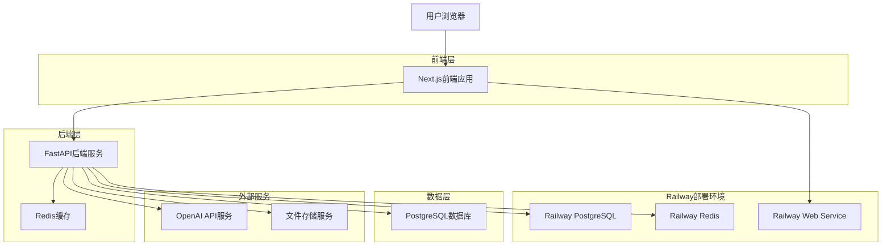
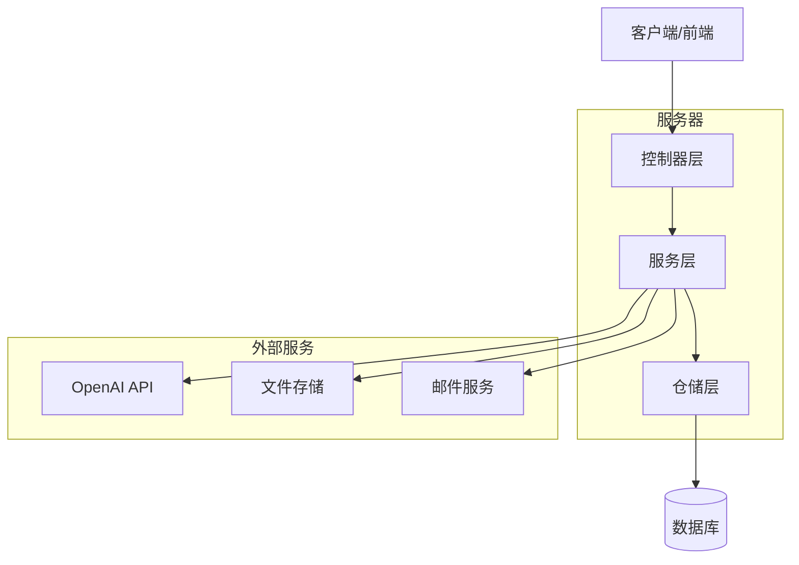

# AI教育平台技术架构文档

## 1. 架构设计



## 2. 技术描述

* **前端**: Next.js\@14 + TypeScript + Tailwind CSS + Shadcn/ui

* **后端**: FastAPI + SQLAlchemy + Alembic + AsyncPG

* **数据库**: PostgreSQL (Railway托管)

* **缓存**: Redis (Railway托管)

* **AI服务**: OpenAI GPT-4 API

* **文件存储**: AWS S3 或 Railway Volume

* **部署平台**: Railway

## 3. 路由定义

### 3.1 前端路由

| 路由                  | 用途                 |
| ------------------- | ------------------ |
| /                   | 首页，根据用户角色重定向到对应仪表板 |
| /login              | 登录页面，用户身份验证        |
| /register           | 注册页面，新用户注册         |
| /dashboard          | 用户仪表板，显示个人概览信息     |
| /classes            | 班级列表页面，显示用户相关的所有班级 |
| /classes/\[id]      | 班级详情页面，显示特定班级的详细信息 |
| /assignments        | 作业列表页面，显示所有作业      |
| /assignments/\[id]  | 作业详情页面，显示特定作业的详细信息 |
| /assignments/create | 创建作业页面（仅教师）        |
| /grading            | AI批改系统页面（仅教师）      |
| /reports            | 学习报告页面，显示学习分析数据    |
| /profile            | 个人资料页面，用户信息管理      |
| /ai-assistant       | AI助手页面，智能问答和学习建议   |

### 3.2 后端API路由

| 路由                  | 用途          |
| ------------------- | ----------- |
| /api/auth/\*        | 用户认证相关接口    |
| /api/users/\*       | 用户管理接口      |
| /api/classes/\*     | 班级管理接口      |
| /api/assignments/\* | 作业管理接口      |
| /api/submissions/\* | 作业提交接口      |
| /api/grading/\*     | AI批改接口      |
| /api/files/\*       | 文件管理接口      |
| /api/analytics/\*   | 学习分析接口      |
| /api/ai-agent/\*    | AI助手接口      |
| /ws/\*              | WebSocket连接 |

## 4. API定义

### 4.1 核心API接口

#### 用户认证

```
POST /api/auth/login
```

请求参数:

| 参数名      | 参数类型   | 是否必需 | 描述   |
| -------- | ------ | ---- | ---- |
| email    | string | true | 用户邮箱 |
| password | string | true | 用户密码 |

响应参数:

| 参数名            | 参数类型   | 描述      |
| -------------- | ------ | ------- |
| access\_token  | string | JWT访问令牌 |
| refresh\_token | string | JWT刷新令牌 |
| user           | object | 用户信息对象  |

示例:

```json
{
  "email": "teacher@example.com",
  "password": "password123"
}
```

#### 班级管理

```
GET /api/classes
POST /api/classes
GET /api/classes/{class_id}
PUT /api/classes/{class_id}
DELETE /api/classes/{class_id}
```

#### 作业管理

```
GET /api/assignments
POST /api/assignments
GET /api/assignments/{assignment_id}
PUT /api/assignments/{assignment_id}
DELETE /api/assignments/{assignment_id}
```

#### AI批改

```
POST /api/grading/tasks
GET /api/grading/tasks/{task_id}
PUT /api/grading/tasks/{task_id}
```

#### 文件管理

```
POST /api/files/upload
GET /api/files/{file_id}
DELETE /api/files/{file_id}
```

### 4.2 前端组件与API映射

#### ClassDashboard组件

* **GET /api/classes/{class\_id}** - 获取班级基本信息

* **GET /api/classes/{class\_id}/students** - 获取班级学生列表

* **GET /api/classes/{class\_id}/stats** - 获取班级统计数据

* **GET /api/assignments?class\_id={class\_id}** - 获取班级作业列表

* **GET /api/analytics/class/{class\_id}/performance** - 获取班级表现数据

#### AssignmentSystem组件

* **GET /api/assignments** - 获取作业列表

* **POST /api/assignments** - 创建新作业

* **PUT /api/assignments/{assignment\_id}** - 更新作业

* **DELETE /api/assignments/{assignment\_id}** - 删除作业

* **GET /api/assignments/{assignment\_id}/submissions** - 获取作业提交列表

* **POST /api/submissions** - 提交作业

#### AIGradingSystem组件

* **POST /api/files/upload** - 上传批改文件

* **POST /api/grading/tasks** - 创建批改任务

* **GET /api/grading/tasks/{task\_id}** - 获取批改进度

* **POST /api/grading/tasks/{task\_id}/distribute** - 分发批改结果

## 5. 服务器架构图



## 6. 数据模型

### 6.1 数据模型定义

```mermaid
erDiagram
    USER ||--o{ CLASS_STUDENT : enrolls
    USER ||--o{ CLASS : teaches
    USER ||--o{ ASSIGNMENT : creates
    USER ||--o{ SUBMISSION : submits
    USER ||--o{ CHAT_MESSAGE : sends
    
    CLASS ||--o{ CLASS_STUDENT : contains
    CLASS ||--o{ ASSIGNMENT : has
    
    ASSIGNMENT ||--o{ SUBMISSION : receives
    ASSIGNMENT ||--o{ FILE : attachments
    
    SUBMISSION ||--o{ FILE : attachments
    SUBMISSION ||--o{ GRADING_TASK : graded_by
    
    USER {
        uuid id PK
        string email UK
        string password_hash
        string name
        enum role
        string avatar_url
        string school
        string grade
        boolean is_active
        boolean is_verified
        timestamp created_at
        timestamp updated_at
        timestamp last_login_at
    }
    
    CLASS {
        uuid id PK
        string name
        string description
        string class_code UK
        string school
        string grade
        string subject
        uuid teacher_id FK
        boolean is_active
        timestamp created_at
        timestamp updated_at
    }
    
    CLASS_STUDENT {
        uuid id PK
        uuid class_id FK
        uuid student_id FK
        boolean is_active
        timestamp joined_at
        timestamp left_at
    }
    
    ASSIGNMENT {
        uuid id PK
        string title
        text description
        text instructions
        string subject
        string topic
        string difficulty_level
        integer total_points
        integer passing_score
        timestamp due_date
        timestamp start_date
        enum status
        uuid teacher_id FK
        uuid class_id FK
        boolean allow_late_submission
        boolean auto_grade
        boolean show_correct_answers
        timestamp created_at
        timestamp updated_at
        timestamp published_at
    }
    
    SUBMISSION {
        uuid id PK
        uuid assignment_id FK
        uuid student_id FK
        text content
        text notes
        enum status
        integer score
        integer max_score
        text feedback
        text teacher_comments
        text ai_feedback
        timestamp submitted_at
        timestamp graded_at
        timestamp returned_at
        timestamp created_at
        timestamp updated_at
    }
    
    FILE {
        uuid id PK
        string filename
        string original_filename
        string file_path
        string file_url
        string mime_type
        integer file_size
        uuid uploaded_by FK
        uuid assignment_id FK
        uuid submission_id FK
        enum file_type
        timestamp created_at
    }
    
    GRADING_TASK {
        uuid id PK
        uuid submission_id FK
        enum status
        enum task_type
        json grading_criteria
        json ai_result
        text error_message
        timestamp created_at
        timestamp updated_at
        timestamp completed_at
    }
```

### 6.2 数据定义语言

#### 用户表 (users)

```sql
-- 创建用户表
CREATE TABLE users (
    id UUID PRIMARY KEY DEFAULT gen_random_uuid(),
    email VARCHAR(255) UNIQUE NOT NULL,
    password_hash VARCHAR(255) NOT NULL,
    name VARCHAR(100) NOT NULL,
    role VARCHAR(20) NOT NULL CHECK (role IN ('student', 'teacher', 'parent')),
    avatar_url VARCHAR(500),
    school VARCHAR(200),
    grade VARCHAR(50),
    is_active BOOLEAN DEFAULT true NOT NULL,
    is_verified BOOLEAN DEFAULT false NOT NULL,
    created_at TIMESTAMP WITH TIME ZONE DEFAULT NOW() NOT NULL,
    updated_at TIMESTAMP WITH TIME ZONE DEFAULT NOW() NOT NULL,
    last_login_at TIMESTAMP WITH TIME ZONE
);

-- 创建索引
CREATE INDEX idx_users_email ON users(email);
CREATE INDEX idx_users_role ON users(role);
CREATE INDEX idx_users_created_at ON users(created_at DESC);
```

#### 班级表 (classes)

```sql
-- 创建班级表
CREATE TABLE classes (
    id UUID PRIMARY KEY DEFAULT gen_random_uuid(),
    name VARCHAR(100) NOT NULL,
    description VARCHAR(500),
    class_code VARCHAR(10) UNIQUE NOT NULL,
    school VARCHAR(200),
    grade VARCHAR(50),
    subject VARCHAR(100),
    teacher_id UUID NOT NULL REFERENCES users(id),
    is_active BOOLEAN DEFAULT true NOT NULL,
    created_at TIMESTAMP WITH TIME ZONE DEFAULT NOW() NOT NULL,
    updated_at TIMESTAMP WITH TIME ZONE DEFAULT NOW() NOT NULL
);

-- 创建索引
CREATE INDEX idx_classes_teacher_id ON classes(teacher_id);
CREATE INDEX idx_classes_class_code ON classes(class_code);
CREATE INDEX idx_classes_created_at ON classes(created_at DESC);
```

#### 班级学生关联表 (class\_students)

```sql
-- 创建班级学生关联表
CREATE TABLE class_students (
    id UUID PRIMARY KEY DEFAULT gen_random_uuid(),
    class_id UUID NOT NULL REFERENCES classes(id),
    student_id UUID NOT NULL REFERENCES users(id),
    is_active BOOLEAN DEFAULT true NOT NULL,
    joined_at TIMESTAMP WITH TIME ZONE DEFAULT NOW() NOT NULL,
    left_at TIMESTAMP WITH TIME ZONE,
    UNIQUE(class_id, student_id)
);

-- 创建索引
CREATE INDEX idx_class_students_class_id ON class_students(class_id);
CREATE INDEX idx_class_students_student_id ON class_students(student_id);
```

#### 作业表 (assignments)

```sql
-- 创建作业表
CREATE TABLE assignments (
    id UUID PRIMARY KEY DEFAULT gen_random_uuid(),
    title VARCHAR(200) NOT NULL,
    description TEXT,
    instructions TEXT,
    subject VARCHAR(100),
    topic VARCHAR(200),
    difficulty_level VARCHAR(20),
    total_points INTEGER DEFAULT 100 NOT NULL,
    passing_score INTEGER,
    due_date TIMESTAMP WITH TIME ZONE,
    start_date TIMESTAMP WITH TIME ZONE,
    status VARCHAR(20) DEFAULT 'draft' NOT NULL CHECK (status IN ('draft', 'active', 'closed', 'archived')),
    teacher_id UUID NOT NULL REFERENCES users(id),
    class_id UUID NOT NULL REFERENCES classes(id),
    allow_late_submission BOOLEAN DEFAULT false,
    auto_grade BOOLEAN DEFAULT true,
    show_correct_answers BOOLEAN DEFAULT false,
    created_at TIMESTAMP WITH TIME ZONE DEFAULT NOW() NOT NULL,
    updated_at TIMESTAMP WITH TIME ZONE DEFAULT NOW() NOT NULL,
    published_at TIMESTAMP WITH TIME ZONE
);

-- 创建索引
CREATE INDEX idx_assignments_teacher_id ON assignments(teacher_id);
CREATE INDEX idx_assignments_class_id ON assignments(class_id);
CREATE INDEX idx_assignments_status ON assignments(status);
CREATE INDEX idx_assignments_due_date ON assignments(due_date);
```

#### 提交表 (submissions)

```sql
-- 创建提交表
CREATE TABLE submissions (
    id UUID PRIMARY KEY DEFAULT gen_random_uuid(),
    assignment_id UUID NOT NULL REFERENCES assignments(id),
    student_id UUID NOT NULL REFERENCES users(id),
    content TEXT,
    notes TEXT,
    status VARCHAR(20) DEFAULT 'pending' NOT NULL CHECK (status IN ('pending', 'submitted', 'grading', 'graded', 'returned')),
    score INTEGER,
    max_score INTEGER,
    feedback TEXT,
    teacher_comments TEXT,
    ai_feedback TEXT,
    submitted_at TIMESTAMP WITH TIME ZONE,
    graded_at TIMESTAMP WITH TIME ZONE,
    returned_at TIMESTAMP WITH TIME ZONE,
    created_at TIMESTAMP WITH TIME ZONE DEFAULT NOW() NOT NULL,
    updated_at TIMESTAMP WITH TIME ZONE DEFAULT NOW() NOT NULL,
    UNIQUE(assignment_id, student_id)
);

-- 创建索引
CREATE INDEX idx_submissions_assignment_id ON submissions(assignment_id);
CREATE INDEX idx_submissions_student_id ON submissions(student_id);
CREATE INDEX idx_submissions_status ON submissions(status);
CREATE INDEX idx_submissions_submitted_at ON submissions(submitted_at DESC);
```

#### 初始化数据

```sql
-- 插入测试用户
INSERT INTO users (email, password_hash, name, role, school, grade) VALUES
('teacher@example.com', '$2b$12$example_hash', '张老师', 'teacher', '示例中学', '高三'),
('student1@example.com', '$2b$12$example_hash', '李小明', 'student', '示例中学', '高三'),
('student2@example.com', '$2b$12$example_hash', '王小红', 'student', '示例中学', '高三'),
('parent@example.com', '$2b$12$example_hash', '李家长', 'parent', '示例中学', '高三');
```

## 7. Railway部署配置

### 7.1 环境变量配置

```bash
# Railway环境变量
ENVIRONMENT=production
DEBUG=false
LOG_LEVEL=INFO

# 数据库配置（Railway自动提供）
DATABASE_URL=${{Postgres.DATABASE_URL}}
REDIS_URL=${{Redis.REDIS_URL}}

# 应用配置
SECRET_KEY=your-production-secret-key
JWT_SECRET_KEY=your-jwt-secret-key
ALLOWED_HOSTS=your-domain.railway.app
CORS_ORIGINS=https://your-frontend-domain.com

# AI服务配置
OPENAI_API_KEY=your-openai-api-key

# 文件存储配置
AWS_ACCESS_KEY_ID=your-aws-access-key
AWS_SECRET_ACCESS_KEY=your-aws-secret-key
AWS_S3_BUCKET=your-s3-bucket
AWS_REGION=us-east-1

# 邮件配置
SMTP_HOST=smtp.gmail.com
SMTP_PORT=587
SMTP_USERNAME=your-email@gmail.com
SMTP_PASSWORD=your-app-password
```

### 7.2 部署步骤

1. **创建Railway项目**

   * 连接GitHub仓库

   * 选择后端目录作为根目录

2. **添加数据库服务**

   * 添加PostgreSQL插件

   * 添加Redis插件

3. **配置环境变量**

   * 设置上述环境变量

   * 配置数据库连接

4. **部署配置**

   * 使用Dockerfile进行部署

   * 配置健康检查

   * 设置自动部署

### 7.3 前端部署

前端可以部署到Vercel或Netlify：

```bash
# 环境变量
NEXT_PUBLIC_API_URL=https://your-backend.railway.app
NEXT_PUBLIC_WS_URL=wss://your-backend.railway.app
```

## 8. 从模拟数据到真实数据的迁移计划

### 8.1 迁移步骤

1. **数据库初始化**

   * 运行Alembic迁移脚本

   * 创建基础数据表

   * 插入初始测试数据

2. **API接口替换**

   * 替换前端组件中的模拟数据调用

   * 添加错误处理和加载状态

   * 实现数据缓存机制

3. **功能测试**

   * 用户注册登录流程

   * 班级创建和管理

   * 作业发布和提交

   * AI批改功能

### 8.2 需要修改的前端组件

1. **ClassDashboard组件**

   * 移除mockStudents等模拟数据

   * 添加API调用hooks

   * 实现数据加载状态

2. **AssignmentSystem组件**

   * 移除mockAssignments模拟数据

   * 集成真实的作业CRUD操作

   * 添加文件上传功能

3. **AIGradingSystem组件**

   * 集成真实的文件上传API

   * 连接AI批改服务

   * 实现批改进度跟踪

### 8.3 性能优化

1. **数据缓存**

   * 使用React Query进行数据缓存

   * 实现Redis缓存策略

   * 优化数据库查询

2. **文件处理**

   * 实现文件压缩和优化

   * 添加文件类型验证

   * 配置CDN加速

3. **实时更新**

   * 使用WebSocket实现实时通知

   * 批改进度实时更新

   * 成绩发布实时推送

