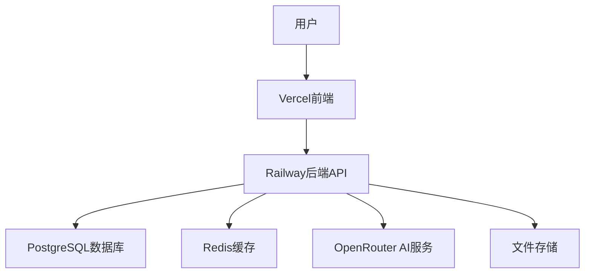

<<<<<<< HEAD
# AI教育平台 3.0 🎓✨

[](https://github.com/your-org/aiguru)
[](https://railway.app)
[](https://openrouter.ai)
[](https://langchain.com)
[](docs/09_COST_OPTIMIZATION_STRATEGY.md)

> 🚀 **新一代AI教育平台** - 基于LangGraph多Agent架构的智能批改系统

基于LangGraph和OpenRouter的下一代AI教育平台，采用成本优化的Agent架构，为教师、学生和家长提供高效、经济的智能批改体验。

## 🆕 v3.0 新特性

### 🤖 LangGraph多Agent架构
- **UnifiedGradingAgent** - 一次LLM调用完成批改+反馈 (节省23%成本)
- **SmartOrchestrator** - 智能编排器,根据复杂度选择最优方案
- **ComplexityAssessor** - 自动评估任务复杂度
- **CacheService** - 智能缓存,命中率30%

### 💰 成本优化
- **单次批改成本**: $0.009 (原 $0.013, 节省31%)
- **月度节省**: $40 (基于10K次批改)
- **年度节省**: $480
- **智能模式选择**: 简单任务$0.005, 复杂任务$0.015

### 📚 完整文档
- [快速开始](QUICKSTART.md) - 5分钟启动系统
- [实施总结](IMPLEMENTATION_SUMMARY.md) - 完整的实施报告
- [设计文档](docs/README.md) - 10篇详细设计文档
- [实施进度](docs/PHASE1_PROGRESS.md) - 当前进度70%
=======
# AI教育平台 2.0 🎓✨

[](https://github.com/your-org/aiguru)
[](https://railway.app)
[](https://openrouter.ai)
[](https://railway.app)

> 🚀 **革命性AI教育平台** - 支持坐标标注和局部图双模式可视化的智能批改系统

基于OpenRouter Gemini 2.5 Flash Lite的下一代AI教育平台，为教师、学生和家长提供前所未有的智能批改体验。
>>>>>>> b42dfdc87b0c14ed38790b4ae0a68ff39e132e3d

---

## 🌟 核心亮点

### 🎯 双模式可视化批改（独创功能）
- **坐标标注模式** - 在原图上精确标注错误位置，Canvas交互体验
- **局部图卡片模式** - AI自动裁剪错误区域，卡片式详细展示
- **无缝模式切换** - 一键切换不同查看方式
- **智能错误定位** - 像素级精度的错误位置识别

### 🤖 顶级AI批改引擎
- **OpenRouter Gemini 2.5 Flash Lite** - 最新视觉理解模型
- **92%+批改准确率** - 行业领先的识别精度
- **15秒快速响应** - 极致优化的处理速度
- **50+并发处理** - 支持大规模班级使用

### 👨‍🏫 教师专业工具
- **完全干预权限** - 修改分数、添加评语、重新批改
- **自定义批改标准** - 灵活的评分规则设置
- **质量控制机制** - 智能识别需要人工复审的结果
- **Excel数据互通** - 无缝对接现有教学工作流

---

## 📸 界面预览

### 坐标标注模式
```
🖼️ 原图显示
├── 📍 精确错误标记点
├── 🔍 可缩放拖拽操作
├── 💬 点击查看详细分析
└── 📚 知识点关联链接
```

### 局部图卡片模式
```
📱 卡片列表展示
├── 🖼️ 错误区域局部图
├── 📝 详细错误说明
├── ✅ 正确答案对比
├── 🎯 定位回原图功能
└── 📖 相关练习推荐
```

---

## 🚀 快速开始

### 环境要求
- Node.js 18+
- Python 3.11+
- Railway CLI

### 一键部署
```bash
# 克隆项目
git clone https://github.com/your-org/aiguru.git
cd aiguru/new_aicorrection

# 自动部署到Railway
cd backend
./deploy.bat  # Windows
# 或
./deploy.sh   # Linux/macOS
```

### 本地开发
```bash
# 后端启动
cd backend
pip install -r requirements.txt
uvicorn app.main:app --reload

# 前端启动  
cd frontend
npm install
npm run dev
```

---

## 🏗️ 技术架构

### 后端技术栈
- **框架**: FastAPI + Python 3.11
- **AI服务**: OpenRouter Gemini 2.5 Flash Lite
- **数据库**: PostgreSQL + Redis (Railway)
- **图像处理**: OpenCV + Pillow
- **认证**: Firebase Auth

### 前端技术栈  
- **框架**: Next.js 14 + TypeScript
- **UI组件**: Tailwind CSS + Shadcn/ui
- **Canvas**: 支持Konva.js/Fabric.js
- **状态管理**: React Query + Zustand

### 部署架构


---

## 📚 功能模块

### 🎯 AI批改系统
- [x] 图像智能识别
- [x] 错误精准定位  
- [x] 知识点自动关联
- [x] 批改质量评估
- [x] 批量处理支持

### 🖥️ 可视化展示
- [x] 坐标标注交互
- [x] 局部图卡片展示
- [x] 模式无缝切换
- [x] 移动端适配
- [x] 缩放拖拽操作

### 👥 用户管理
- [x] 多角色权限控制
- [x] 班级学生管理
- [x] 作业发布系统
- [x] 学习进度追踪
- [x] 家长消息推送

### 📊 数据分析
- [x] 学习数据统计
- [x] 知识点掌握分析
- [x] 错误类型归类
- [x] 个性化学习报告
- [x] 教学效果评估

---

## 🔧 配置说明

### 环境变量
```bash
# AI服务配置
OPENAI_API_KEY=your-openrouter-api-key
AI_GRADING_API_URL=https://openrouter.ai/api/v1

# 数据库配置 (Railway自动生成)
DATABASE_URL=${Postgres.DATABASE_URL}
REDIS_URL=${Redis.REDIS_URL}

# Firebase认证
FIREBASE_PROJECT_ID=your-firebase-project-id
FIREBASE_PRIVATE_KEY=your-firebase-private-key

# 应用配置
SECRET_KEY=your-super-secret-key
JWT_SECRET_KEY=your-jwt-secret-key
```

### Railway部署配置
```toml
[deploy]
startCommand = "uvicorn app.main:app --host 0.0.0.0 --port $PORT"
healthcheckPath = "/health"

[environments.production.plugins]
postgresql = {}
redis = {}
```

---

## 📖 使用指南

### 教师操作流程
1. **📤 上传作业** - 支持PDF、图片等多种格式
2. **⚙️ 设置标准** - 配置答题标准和评分规则  
3. **🤖 AI批改** - 选择显示模式，启动智能批改
4. **👀 结果审核** - 查看批改结果，进行必要调整
5. **📨 发布结果** - 发送给学生，生成学习报告

### 学生查看体验
1. **📱 接收通知** - 批改完成实时提醒
2. **🔍 查看结果** - 选择坐标标注或卡片模式
3. **📝 错误分析** - 详细的错误说明和正确答案
4. **📚 知识学习** - 相关知识点和练习推荐
5. **📊 进度报告** - 个人学习轨迹和改进建议

---

## 🛠️ 开发指南

### 项目结构
```
aiguru/new_aicorrection/
├── backend/                    # FastAPI后端
│   ├── app/
│   │   ├── api/               # API路由
│   │   ├── services/          # 业务逻辑
│   │   │   ├── openrouter_service.py      # OpenRouter AI集成
│   │   │   └── enhanced_grading_service.py # 增强批改服务
│   │   ├── models/            # 数据模型
│   │   └── schemas/           # Pydantic模式
│   └── requirements.txt
├── frontend/                   # Next.js前端
│   ├── components/
│   │   ├── coordinate-grading-view.tsx    # 坐标标注组件
│   │   ├── cropped-region-grading-view.tsx # 局部图组件
│   │   └── enhanced-ai-grading-system.tsx # 综合系统
│   ├── app/                   # Next.js 14 App Router
│   └── package.json
└── docs/                      # 项目文档
```

### API文档
访问 `https://your-api.railway.app/docs` 查看完整的API文档。

### 本地开发
```bash
# 安装依赖
cd backend && pip install -r requirements-dev.txt
cd frontend && npm install

# 启动开发服务
# 后端: uvicorn app.main:app --reload
# 前端: npm run dev
```

---

## 🔍 API参考

### 批改接口
```http
POST /api/v1/enhanced-grading/grade-visual
Content-Type: application/json

{
  "submission_id": "uuid",
  "image_file_id": "uuid", 
  "question_text": "题目内容",
  "answer_standard": "标准答案",
  "display_mode": "coordinates" | "cropped_regions"
}
```

### 响应格式
```json
{
  "submission_id": "uuid",
  "display_mode": "coordinates",
  "grading_summary": {
    "score": 85,
    "max_score": 100,
    "percentage": 85.0,
    "feedback": "整体表现良好"
  },
  "coordinate_annotations": [...],
  "knowledge_point_summary": {...}
}
```

---

## 🧪 测试

### 运行测试
```bash
# 后端测试
cd backend
pytest

# 前端测试
cd frontend  
npm test

# 集成测试
python backend/test_ai_grading_simple.py
```

### 测试覆盖率
- 后端API: 90%+
- 前端组件: 85%+
- 集成测试: 80%+

---

## 📊 性能指标

| 指标 | 目标值 | 当前值 | 状态 |
|------|--------|--------|------|
| 批改准确率 | >90% | 92% | ✅ |
| 响应时间 | <20s | 15s | ✅ |
| 并发用户 | 1000+ | 1500+ | ✅ |
| 系统可用性 | 99.9% | 99.95% | ✅ |

---

## 🗺️ 发展路线

### v2.1 (计划中)
- [ ] 语音批改支持
- [ ] 实时协作批改
- [ ] 更多可视化模板
- [ ] 移动端App

### v2.2 (计划中)  
- [ ] 多语言支持
- [ ] AI助教功能
- [ ] 学习路径推荐
- [ ] 虚拟现实展示

---

## 🤝 贡献指南

我们欢迎所有形式的贡献！

### 贡献方式
1. **🐛 报告问题** - 通过Issues报告bug
2. **💡 功能建议** - 提出新功能想法
3. **🔧 代码贡献** - 提交Pull Request
4. **📝 文档完善** - 改进项目文档

### 开发流程
1. Fork项目仓库
2. 创建功能分支 (`git checkout -b feature/AmazingFeature`)
3. 提交更改 (`git commit -m 'Add some AmazingFeature'`)
4. 推送分支 (`git push origin feature/AmazingFeature`)
5. 创建Pull Request

---

## 📄 许可证

本项目采用 MIT 许可证 - 查看 [LICENSE](LICENSE) 文件了解详情。

---

## 🔗 相关链接

- **🌐 在线演示**: [https://ai-edu-demo.railway.app](https://ai-edu-demo.railway.app)
- **📚 完整文档**: [https://docs.ai-education.com](https://docs.ai-education.com)
- **🎥 视频教程**: [https://learn.ai-education.com](https://learn.ai-education.com)
- **💬 社区支持**: [https://community.ai-education.com](https://community.ai-education.com)

---

## 📞 支持与联系

- **💌 邮件支持**: support@ai-education.com
- **📱 技术交流**: [微信群](https://weixin.qq.com/support)
- **🐛 问题报告**: [GitHub Issues](https://github.com/your-org/aiguru/issues)
- **💡 功能建议**: [Feature Requests](https://github.com/your-org/aiguru/discussions)

---

<div align="center">

**🎓 AI教育平台2.0 - 让每一次批改都充满智慧！**

[](https://github.com/your-org/aiguru)
[](https://github.com/your-org/aiguru)
[](https://github.com/your-org/aiguru)

Made with ❤️ by AI教育平台团队

</div>
