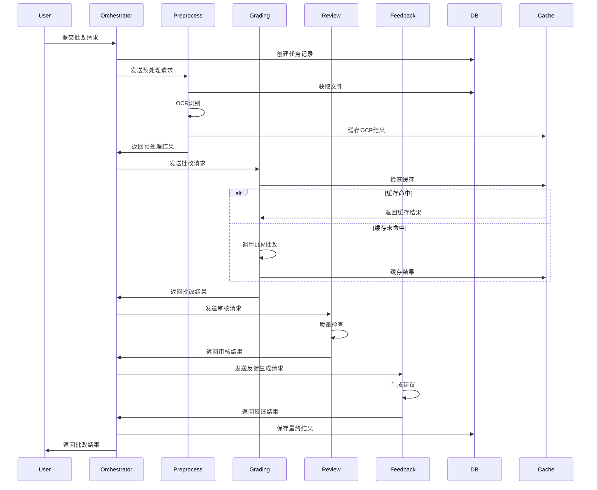

# Agent协作策略文档

## 📌 文档概述

本文档详细描述Agent之间的协作模式、通信机制、数据流转和错误处理策略。

---

## 1. 协作模式设计

### 1.1 工作流模式

#### 模式1: 线性Pipeline (单份批改)
```
PreprocessAgent → GradingAgent → ReviewAgent → FeedbackAgent
```

**适用场景**: 单份作业批改,需要完整的质量控制

**实现**:
```python
class LinearPipeline:
    """线性Pipeline模式"""
    
    async def execute(self, submission_id: UUID) -> GradingResult:
        state = GradingState(submission_id=submission_id)
        
        # Step 1: 预处理
        state = await self.preprocess_agent.process(state)
        if state.status == "failed":
            return self._handle_failure(state)
        
        # Step 2: 批改
        state = await self.grading_agent.process(state)
        if state.status == "failed":
            return self._handle_failure(state)
        
        # Step 3: 审核
        if state.config.get("enable_review"):
            state = await self.review_agent.process(state)
        
        # Step 4: 生成反馈
        state = await self.feedback_agent.process(state)
        
        return self._build_result(state)
```

#### 模式2: 并行处理 (批量批改)
```
                    ┌─→ GradingAgent1 ─→ ReviewAgent1 ─┐
PreprocessAgent ─→  ├─→ GradingAgent2 ─→ ReviewAgent2 ─┤ ─→ AggregatorAgent
                    └─→ GradingAgent3 ─→ ReviewAgent3 ─┘
```

**适用场景**: 批量作业批改,需要高吞吐量

**实现**:
```python
class ParallelPipeline:
    """并行Pipeline模式"""
    
    async def execute(self, submission_ids: List[UUID]) -> List[GradingResult]:
        # Step 1: 批量预处理
        preprocess_tasks = [
            self.preprocess_agent.process(GradingState(submission_id=sid))
            for sid in submission_ids
        ]
        preprocessed_states = await asyncio.gather(*preprocess_tasks)
        
        # Step 2: 并发批改(带限流)
        semaphore = asyncio.Semaphore(10)  # 最多10个并发
        
        async def grade_with_limit(state):
            async with semaphore:
                state = await self.grading_agent.process(state)
                if state.config.get("enable_review"):
                    state = await self.review_agent.process(state)
                state = await self.feedback_agent.process(state)
                return state
        
        grading_tasks = [
            grade_with_limit(state)
            for state in preprocessed_states
            if state.status != "failed"
        ]
        
        results = await asyncio.gather(*grading_tasks, return_exceptions=True)
        
        # Step 3: 聚合结果
        return await self.aggregator_agent.aggregate(results)
```

#### 模式3: 条件分支 (智能路由)
```
                    ┌─→ SimpleGradingAgent (置信度高)
GradingAgent ─→     │
                    └─→ DetailedGradingAgent → ReviewAgent (置信度低)
```

**适用场景**: 根据内容复杂度选择不同的处理路径

**实现**:
```python
class ConditionalPipeline:
    """条件分支Pipeline"""
    
    async def execute(self, state: GradingState) -> GradingResult:
        # 预处理
        state = await self.preprocess_agent.process(state)
        
        # 评估复杂度
        complexity = await self._assess_complexity(state)
        
        if complexity == "simple":
            # 简单路径: 快速批改
            state = await self.simple_grading_agent.process(state)
        else:
            # 复杂路径: 详细批改 + 审核
            state = await self.detailed_grading_agent.process(state)
            state = await self.review_agent.process(state)
        
        # 生成反馈
        state = await self.feedback_agent.process(state)
        
        return self._build_result(state)
    
    async def _assess_complexity(self, state: GradingState) -> str:
        """评估作业复杂度"""
        # 基于文本长度、题目类型等判断
        text_length = len(state.extracted_text)
        has_images = len(state.preprocessed_files) > 0
        
        if text_length < 500 and not has_images:
            return "simple"
        return "complex"
```

---

## 2. 通信机制

### 2.1 状态共享机制

**LangGraph State**:
```python
from typing import TypedDict, Annotated
from langgraph.graph import StateGraph, add_messages

class GradingState(TypedDict):
    """共享状态定义"""
    # 基础信息
    submission_id: UUID
    assignment_id: UUID
    student_id: UUID
    
    # 处理状态
    status: str
    current_step: str
    progress: float  # 0-100
    
    # 数据流转
    messages: Annotated[list, add_messages]  # Agent间消息
    preprocessed_data: Dict
    grading_result: Dict
    review_result: Dict
    feedback_result: Dict
    
    # 元数据
    metadata: Dict
    errors: List[str]
    warnings: List[str]
```

**状态更新模式**:
```python
class AgentBase:
    """Agent基类"""
    
    async def process(self, state: GradingState) -> GradingState:
        """处理逻辑"""
        # 1. 读取状态
        input_data = self._extract_input(state)
        
        # 2. 执行处理
        result = await self._execute(input_data)
        
        # 3. 更新状态
        state = self._update_state(state, result)
        
        # 4. 添加消息
        state["messages"].append({
            "agent": self.name,
            "timestamp": datetime.utcnow(),
            "action": "processed",
            "result_summary": result.summary
        })
        
        return state
```

### 2.2 消息传递机制

**消息类型**:
```python
class MessageType(Enum):
    """消息类型"""
    REQUEST = "request"          # 请求处理
    RESPONSE = "response"        # 处理结果
    NOTIFICATION = "notification"  # 通知
    ERROR = "error"              # 错误
    PROGRESS = "progress"        # 进度更新
```

**消息结构**:
```python
class AgentMessage(BaseModel):
    """Agent消息"""
    id: UUID = Field(default_factory=uuid4)
    correlation_id: UUID  # 关联整个流程
    from_agent: str
    to_agent: Optional[str]  # None表示广播
    message_type: MessageType
    payload: Dict[str, Any]
    timestamp: datetime = Field(default_factory=datetime.utcnow)
    priority: int = 0  # 优先级
    
    class Config:
        json_encoders = {
            UUID: str,
            datetime: lambda v: v.isoformat()
        }
```

**消息总线**:
```python
class MessageBus:
    """消息总线 - 用于Agent间通信"""
    
    def __init__(self):
        self.subscribers: Dict[str, List[Callable]] = {}
        self.message_history: List[AgentMessage] = []
    
    def subscribe(self, agent_name: str, handler: Callable):
        """订阅消息"""
        if agent_name not in self.subscribers:
            self.subscribers[agent_name] = []
        self.subscribers[agent_name].append(handler)
    
    async def publish(self, message: AgentMessage):
        """发布消息"""
        self.message_history.append(message)
        
        # 广播或定向发送
        if message.to_agent:
            handlers = self.subscribers.get(message.to_agent, [])
        else:
            # 广播给所有订阅者
            handlers = [h for hs in self.subscribers.values() for h in hs]
        
        # 异步调用所有处理器
        await asyncio.gather(*[h(message) for h in handlers])
    
    def get_history(self, correlation_id: UUID) -> List[AgentMessage]:
        """获取特定流程的消息历史"""
        return [
            msg for msg in self.message_history
            if msg.correlation_id == correlation_id
        ]
```

---

## 3. 数据流转设计

### 3.1 数据流图



### 3.2 数据传递格式

**Agent输入输出标准化**:
```python
class AgentInput(BaseModel):
    """Agent输入标准格式"""
    task_id: UUID
    data: Dict[str, Any]
    context: Dict[str, Any]
    config: Dict[str, Any]

class AgentOutput(BaseModel):
    """Agent输出标准格式"""
    task_id: UUID
    success: bool
    data: Dict[str, Any]
    metadata: Dict[str, Any]
    errors: List[str] = []
    warnings: List[str] = []
    execution_time_ms: int
```

**数据验证**:
```python
class DataValidator:
    """数据验证器"""
    
    @staticmethod
    def validate_preprocess_output(output: AgentOutput) -> bool:
        """验证预处理输出"""
        required_fields = ["extracted_text", "preprocessed_files"]
        return all(field in output.data for field in required_fields)
    
    @staticmethod
    def validate_grading_output(output: AgentOutput) -> bool:
        """验证批改输出"""
        required_fields = ["score", "errors", "confidence"]
        return all(field in output.data for field in required_fields)
```

---

## 4. 错误处理与恢复

### 4.1 错误分类

```python
class ErrorSeverity(Enum):
    """错误严重程度"""
    LOW = "low"          # 可忽略,不影响结果
    MEDIUM = "medium"    # 需要记录,可能影响质量
    HIGH = "high"        # 需要重试
    CRITICAL = "critical"  # 需要人工介入
```

**错误类型**:
```python
class AgentError(Exception):
    """Agent错误基类"""
    def __init__(self, message: str, severity: ErrorSeverity, recoverable: bool = True):
        self.message = message
        self.severity = severity
        self.recoverable = recoverable
        super().__init__(message)

class PreprocessError(AgentError):
    """预处理错误"""
    pass

class GradingError(AgentError):
    """批改错误"""
    pass

class ReviewError(AgentError):
    """审核错误"""
    pass
```

### 4.2 重试策略

**指数退避重试**:
```python
class RetryStrategy:
    """重试策略"""
    
    def __init__(
        self,
        max_retries: int = 3,
        initial_delay: float = 1.0,
        max_delay: float = 60.0,
        exponential_base: float = 2.0
    ):
        self.max_retries = max_retries
        self.initial_delay = initial_delay
        self.max_delay = max_delay
        self.exponential_base = exponential_base
    
    async def execute_with_retry(
        self,
        func: Callable,
        *args,
        **kwargs
    ) -> Any:
        """执行函数并在失败时重试"""
        last_exception = None
        
        for attempt in range(self.max_retries + 1):
            try:
                return await func(*args, **kwargs)
            
            except Exception as e:
                last_exception = e
                
                if attempt == self.max_retries:
                    # 达到最大重试次数
                    break
                
                # 计算延迟时间
                delay = min(
                    self.initial_delay * (self.exponential_base ** attempt),
                    self.max_delay
                )
                
                logger.warning(
                    f"Attempt {attempt + 1} failed: {e}. "
                    f"Retrying in {delay}s..."
                )
                
                await asyncio.sleep(delay)
        
        # 所有重试都失败
        raise last_exception

# 使用装饰器
def with_retry(max_retries: int = 3):
    """重试装饰器"""
    def decorator(func):
        @wraps(func)
        async def wrapper(*args, **kwargs):
            strategy = RetryStrategy(max_retries=max_retries)
            return await strategy.execute_with_retry(func, *args, **kwargs)
        return wrapper
    return decorator

# 应用
class GradingAgent:
    @with_retry(max_retries=3)
    async def call_llm(self, prompt: str) -> str:
        """调用LLM(带重试)"""
        return await self.llm.ainvoke(prompt)
```

### 4.3 降级策略

**优雅降级**:
```python
class GracefulDegradation:
    """优雅降级"""
    
    async def execute_with_fallback(
        self,
        primary_func: Callable,
        fallback_func: Callable,
        *args,
        **kwargs
    ) -> Any:
        """执行主函数,失败时使用降级函数"""
        try:
            return await primary_func(*args, **kwargs)
        except Exception as e:
            logger.warning(f"Primary function failed: {e}. Using fallback.")
            return await fallback_func(*args, **kwargs)

# 示例
class ReviewAgent:
    async def process(self, state: GradingState) -> GradingState:
        """审核处理(带降级)"""
        degradation = GracefulDegradation()
        
        state = await degradation.execute_with_fallback(
            primary_func=self._detailed_review,
            fallback_func=self._simple_review,
            state=state
        )
        
        return state
    
    async def _detailed_review(self, state: GradingState) -> GradingState:
        """详细审核(可能失败)"""
        # 复杂的审核逻辑
        pass
    
    async def _simple_review(self, state: GradingState) -> GradingState:
        """简单审核(降级方案)"""
        # 基础的审核逻辑
        state.review_passed = True
        state.review_comments = "使用简化审核流程"
        return state
```

### 4.4 断点续传

**状态持久化**:
```python
class CheckpointManager:
    """检查点管理器"""
    
    def __init__(self, redis_client):
        self.redis = redis_client
    
    async def save_checkpoint(
        self,
        task_id: UUID,
        step: str,
        state: GradingState
    ):
        """保存检查点"""
        checkpoint_key = f"checkpoint:{task_id}:{step}"
        await self.redis.set(
            checkpoint_key,
            json.dumps(state, default=str),
            ex=3600  # 1小时过期
        )
    
    async def load_checkpoint(
        self,
        task_id: UUID,
        step: str
    ) -> Optional[GradingState]:
        """加载检查点"""
        checkpoint_key = f"checkpoint:{task_id}:{step}"
        data = await self.redis.get(checkpoint_key)
        
        if data:
            return GradingState(**json.loads(data))
        return None
    
    async def resume_from_checkpoint(
        self,
        task_id: UUID
    ) -> GradingState:
        """从检查点恢复"""
        # 查找最新的检查点
        steps = ["preprocess", "grade", "review", "feedback"]
        
        for step in reversed(steps):
            state = await self.load_checkpoint(task_id, step)
            if state:
                logger.info(f"Resuming from checkpoint: {step}")
                return state
        
        raise ValueError(f"No checkpoint found for task {task_id}")

# 使用
class OrchestratorAgent:
    async def execute(self, input_data: Dict) -> Dict:
        """执行(支持断点续传)"""
        task_id = input_data["task_id"]
        
        try:
            # 尝试从检查点恢复
            state = await self.checkpoint_manager.resume_from_checkpoint(task_id)
            logger.info(f"Resumed task {task_id} from checkpoint")
        except ValueError:
            # 没有检查点,从头开始
            state = GradingState(**input_data)
        
        # 执行流程
        if state.current_step == "preprocess" or not state.current_step:
            state = await self.preprocess_agent.process(state)
            await self.checkpoint_manager.save_checkpoint(task_id, "preprocess", state)
        
        if state.current_step == "grade":
            state = await self.grading_agent.process(state)
            await self.checkpoint_manager.save_checkpoint(task_id, "grade", state)
        
        # ... 其他步骤
        
        return state
```

---

## 5. 并发控制

### 5.1 限流机制

**令牌桶算法**:
```python
class TokenBucket:
    """令牌桶限流器"""
    
    def __init__(self, rate: float, capacity: int):
        self.rate = rate  # 每秒生成的令牌数
        self.capacity = capacity  # 桶容量
        self.tokens = capacity
        self.last_update = time.time()
        self.lock = asyncio.Lock()
    
    async def acquire(self, tokens: int = 1) -> bool:
        """获取令牌"""
        async with self.lock:
            now = time.time()
            # 补充令牌
            elapsed = now - self.last_update
            self.tokens = min(
                self.capacity,
                self.tokens + elapsed * self.rate
            )
            self.last_update = now
            
            # 检查是否有足够的令牌
            if self.tokens >= tokens:
                self.tokens -= tokens
                return True
            return False
    
    async def wait_for_token(self, tokens: int = 1):
        """等待直到获取到令牌"""
        while not await self.acquire(tokens):
            await asyncio.sleep(0.1)

# 使用
class GradingAgent:
    def __init__(self):
        # 限制每秒最多10次LLM调用
        self.rate_limiter = TokenBucket(rate=10, capacity=20)
    
    async def call_llm(self, prompt: str) -> str:
        """调用LLM(带限流)"""
        await self.rate_limiter.wait_for_token()
        return await self.llm.ainvoke(prompt)
```

### 5.2 并发控制

**信号量控制**:
```python
class ConcurrencyController:
    """并发控制器"""
    
    def __init__(self, max_concurrent: int = 10):
        self.semaphore = asyncio.Semaphore(max_concurrent)
        self.active_tasks = 0
        self.lock = asyncio.Lock()
    
    async def execute(self, func: Callable, *args, **kwargs):
        """执行函数(并发控制)"""
        async with self.semaphore:
            async with self.lock:
                self.active_tasks += 1
            
            try:
                result = await func(*args, **kwargs)
                return result
            finally:
                async with self.lock:
                    self.active_tasks -= 1
    
    def get_active_count(self) -> int:
        """获取当前活跃任务数"""
        return self.active_tasks
```

---

**下一步**: 查看 `04_SCALABILITY_RELIABILITY.md` 了解可扩展性和可靠性设计

